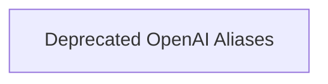

# OpenAI Model Aliases

The `openai_model_aliases` module provides compatibility aliases for OpenAI chat models and their settings within the `pydantic_ai_slim` framework. This module helps in transitioning from older naming conventions to newer, more explicit ones, ensuring backward compatibility while encouraging the use of updated class names.

## Architecture

The `openai_model_aliases` module itself is a small component providing direct aliases. Its core functionality is encapsulated within a single sub-module:

<!-- DIAGRAM_JSON
{
    "direction": "TD",
    "nodes": [
        {"id": "deprecated_openai_aliases", "label": "Deprecated OpenAI Aliases", "type": "module", "link": "deprecated_openai_aliases.md"}
    ],
    "edges": [],
    "groups": []
}
-->

## Sub-modules

### [Deprecated OpenAI Aliases](deprecated_openai_aliases.md)
This sub-module contains the deprecated `OpenAIModel` and `OpenAIModelSettings` classes, which serve as aliases to `OpenAIChatModel` and `OpenAIChatModelSettings` respectively. It ensures that existing codebases using the older names can still function correctly.
