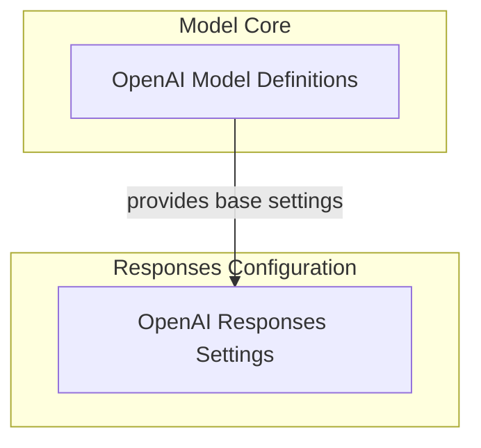

# `openai_model_configuration` Module

## Introduction

The `openai_model_configuration` module is responsible for defining and managing the configuration settings for OpenAI models, with a particular focus on the advanced features available through the OpenAI Responses API. It provides the foundational model definitions and specific settings to control model behavior, reasoning, and the inclusion of various tool outputs.

## Architecture Overview

This module is structured to separate the core model definitions from the more intricate settings related to the OpenAI Responses API. The core model definitions provide the basic structure, while the responses settings extend these with fine-grained control over model interactions and data retrieval.

<!-- DIAGRAM_JSON
{
    "direction": "TD",
    "nodes": [
        {
            "id": "openai_model_configuration",
            "label": "OpenAI Model Configuration",
            "type": "module"
        },
        {
            "id": "openai_model_definitions",
            "label": "OpenAI Model Definitions",
            "type": "module",
            "link": "openai_model_definitions.md"
        },
        {
            "id": "openai_responses_settings",
            "label": "OpenAI Responses Settings",
            "type": "module",
            "link": "openai_responses_settings.md"
        }
    ],
    "edges": [
        {
            "source": "openai_model_definitions",
            "target": "openai_responses_settings",
            "label": "provides base settings"
        }
    ],
    "groups": [
        {
            "id": "model_core",
            "label": "Model Core",
            "role": "generative",
            "nodes": [
                "openai_model_definitions"
            ]
        },
        {
            "id": "responses_config",
            "label": "Responses Configuration",
            "role": "analytical",
            "nodes": [
                "openai_responses_settings"
            ]
        }
    ]
}
-->

## Sub-modules

### [OpenAI Model Definitions](openai_model_definitions.md)
This sub-module establishes the fundamental classes for OpenAI models and their generic settings. It includes deprecated aliases for `OpenAIChatModel` and `OpenAIChatModelSettings`, providing compatibility while guiding towards updated practices.

### [OpenAI Responses Settings](openai_responses_settings.md)
This sub-module focuses on the detailed configuration parameters for models utilizing the OpenAI Responses API. It allows for precise control over aspects like reasoning summaries, truncation strategies, verbosity of text responses, and the inclusion of outputs from built-in tools such as file search and web search.

## Related Modules

This module works in conjunction with the [openai_response_handling.md](openai_response_handling.md) module, which is responsible for processing and mapping the streaming and non-streaming responses generated by the OpenAI models configured here.
