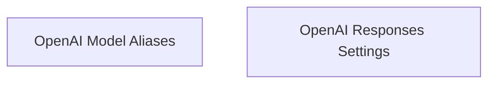

# OpenAI Model Configuration

The `openai_model_configuration` module provides the necessary classes and settings for interacting with OpenAI models, particularly focusing on the OpenAI Responses API. It includes configurations for model behavior, built-in tools, reasoning summaries, and response handling.

## Architecture Overview

The module is structured into two main sub-modules:

- **[OpenAI Model Aliases](openai_model_aliases.md)**: Manages deprecated aliases for OpenAI chat models and their general settings.
- **[OpenAI Responses Settings](openai_responses_settings.md)**: Defines comprehensive settings for making requests to the OpenAI Responses API.

<!-- DIAGRAM_JSON
{
    "direction": "TD",
    "nodes": [
        {"id": "openai_model_aliases", "label": "OpenAI Model Aliases", "type": "module", "link": "openai_model_aliases.md"},
        {"id": "openai_responses_settings", "label": "OpenAI Responses Settings", "type": "module", "link": "openai_responses_settings.md"}
    ],
    "edges": [],
    "groups": []
}
-->

