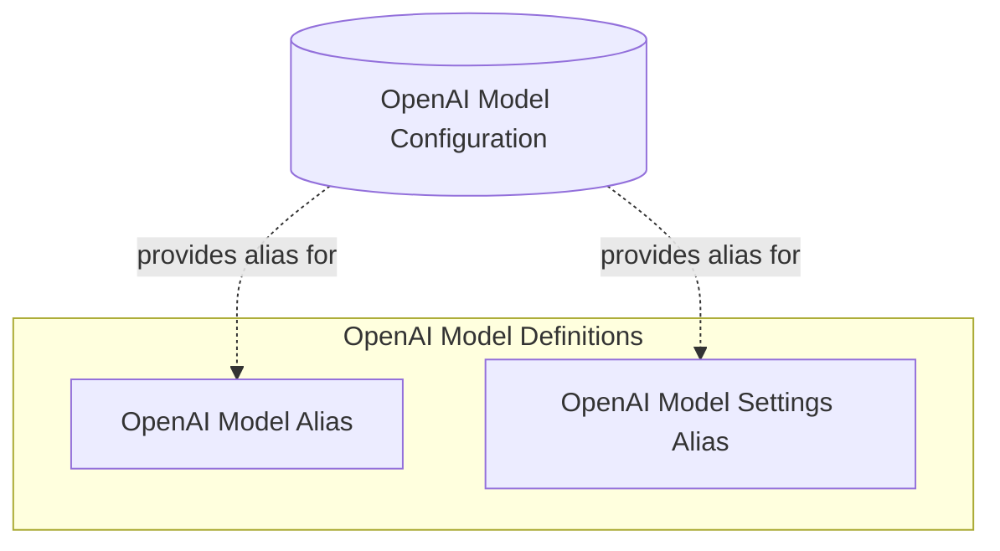

# OpenAI Model Definitions

The `openai_model_definitions` module serves as a compatibility layer, providing deprecated aliases for the core OpenAI chat model and its associated settings. These aliases point to more current implementations found in `OpenAIChatModel` and `OpenAIChatModelSettings`, ensuring backward compatibility for existing codebases while encouraging migration to the updated classes.

## Architecture Overview

This module is a part of the broader `openai_model_configuration` sub-module within the `pydantic_ai_slim` framework. It comprises two main aliases: one for the OpenAI model itself and another for its configuration settings. Both aliases simply redirect to their respective `OpenAIChat` counterparts, maintaining the overall structure without introducing new functionalities.

<!-- DIAGRAM_JSON
{
    "direction": "TD",
    "nodes": [
        {"id": "openai_model_configuration", "label": "OpenAI Model Configuration", "type": "external", "link": "openai_model_configuration.md"},
        {"id": "openai_model_alias", "label": "OpenAI Model Alias", "type": "module", "link": "openai_model_alias.md"},
        {"id": "openai_settings_alias", "label": "OpenAI Model Settings Alias", "type": "module", "link": "openai_settings_alias.md"}
    ],
    "edges": [
        {"source": "openai_model_configuration", "target": "openai_model_alias", "label": "provides alias for"},
        {"source": "openai_model_configuration", "target": "openai_settings_alias", "label": "provides alias for"}
    ],
    "groups": [
        {
            "id": "aliases",
            "label": "Deprecated Aliases",
            "role": "data",
            "nodes": ["openai_model_alias", "openai_settings_alias"]
        }
    ]
}
-->

## Sub-modules

-   **[OpenAI Model Alias](openai_model_alias.md)**: Provides a deprecated alias for the core OpenAI chat model.
-   **[OpenAI Model Settings Alias](openai_settings_alias.md)**: Provides a deprecated alias for the OpenAI chat model settings.
