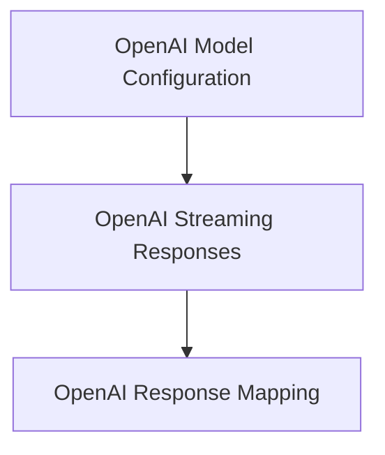

# OpenAI Model Integration

The `openai_model_integration` module provides the necessary components for interacting with OpenAI models within the larger system. It handles the specific implementation details for sending requests to and processing responses from OpenAI's API, ensuring compatibility and efficient data handling.

## Architecture

This module is structured into several sub-modules, each responsible for a distinct aspect of OpenAI model interaction:

<!-- DIAGRAM_JSON
{
    "direction": "TD",
    "nodes": [
        {"id": "openai_model_configuration", "label": "OpenAI Model Configuration", "type": "module", "link": "openai_model_configuration.md"},
        {"id": "openai_response_mapping", "label": "OpenAI Response Mapping", "type": "module", "link": "openai_response_mapping.md"},
        {"id": "openai_streaming_responses", "label": "OpenAI Streaming Responses", "type": "module", "link": "openai_streaming_responses.md"}
    ],
    "edges": [
        {"source": "openai_streaming_responses", "target": "openai_response_mapping"},
        {"source": "openai_model_configuration", "target": "openai_streaming_responses"}
    ],
    "groups": []
}
-->

## Sub-modules

### [OpenAI Model Configuration](openai_model_configuration.md)
This sub-module defines and manages model-specific settings for OpenAI models, including response behavior, built-in tools, and reasoning options. It also contains deprecated aliases for model and model settings classes.

### [OpenAI Response Mapping](openai_response_mapping.md)
This sub-module handles the transformation of internal `ModelResponse` objects into OpenAI-compatible chat completion parameters. It also manages the mapping of various content types, including binary data, for appropriate handling by the OpenAI API.

### [OpenAI Streaming Responses](openai_streaming_responses.md)
This sub-module is responsible for the processing and interpretation of streaming responses from OpenAI models. It manages parsing incoming data chunks, handling API errors, extracting usage statistics, and mapping different types of delta content such as text, thinking processes, and tool calls.