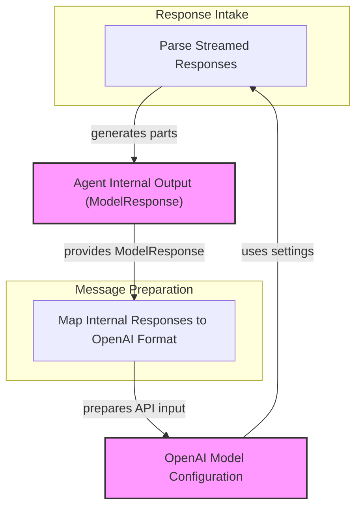

# OpenAI Response Handling Module

The `openai_response_handling` module is a critical component within the `pydantic_ai_agent_core` responsible for managing the intricate process of interacting with OpenAI models. It focuses on both the ingestion and interpretation of streamed responses from OpenAI, as well as the structured preparation of internal model outputs and rich content for submission back to the OpenAI API. This module ensures seamless communication by translating raw OpenAI data into the system's internal representations and vice-versa, facilitating robust agent capabilities and conversational flow.

## Architecture Overview

The module is composed of two primary sub-modules: `streamed_response_parser` and `model_response_mapper`. These sub-modules work in tandem to handle the bidirectional data flow with OpenAI. The `streamed_response_parser` is responsible for consuming and interpreting the real-time streamed output from OpenAI models, converting raw data chunks into structured events and parts. Conversely, the `model_response_mapper` focuses on transforming the AI agent's internal `ModelResponse` objects and various content types into the specific message formats required by the OpenAI API for subsequent interactions or tool calls.

While `streamed_response_parser` handles incoming data, `model_response_mapper` prepares outgoing data. This clear separation of concerns ensures that the module can efficiently manage the complexities of OpenAI API interactions.

<!-- DIAGRAM_JSON
{
    "direction": "TD",
    "nodes": [
        {"id": "streamed_response_parser", "label": "Parse Streamed Responses", "type": "module", "link": "streamed_response_parser.md"},
        {"id": "model_response_mapper", "label": "Map Internal Responses to OpenAI Format", "type": "module", "link": "model_response_mapper.md"},
        {"id": "openai_model_config", "label": "OpenAI Model Configuration", "type": "external", "link": "openai_model_configuration.md"},
        {"id": "agent_output", "label": "Agent Internal Output (ModelResponse)", "type": "external", "link": "agent_output_handling.md"}
    ],
    "edges": [
        {"source": "openai_model_config", "target": "streamed_response_parser", "label": "uses settings"},
        {"source": "streamed_response_parser", "target": "agent_output", "label": "generates parts"},
        {"source": "agent_output", "target": "model_response_mapper", "label": "provides ModelResponse"},
        {"source": "model_response_mapper", "target": "openai_model_config", "label": "prepares API input"}
    ],
    "groups": [
        {
            "id": "response_intake",
            "label": "Response Intake",
            "role": "generative",
            "nodes": ["streamed_response_parser"]
        },
        {
            "id": "message_preparation",
            "label": "Message Preparation",
            "role": "analytical",
            "nodes": ["model_response_mapper"]
        }
    ]
}
-->

## Sub-modules

### [Streamed Response Parser](streamed_response_parser.md)
This sub-module is dedicated to processing and interpreting the continuous stream of data received from OpenAI models. It handles the mapping of raw `ChatCompletionChunk` objects into structured `ModelResponseStreamEvent`s, extracts usage statistics, determines finish reasons, and correctly processes various delta types including thinking, text, and tool calls. It's the primary component for understanding and utilizing real-time model output.

### [Model Response Mapper](model_response_mapper.md)
The `model_response_mapper` sub-module focuses on translating the internal `ModelResponse` objects (generated by the AI agent's logic) into the specific message formats required by the OpenAI API. This includes constructing `ChatCompletionAssistantMessageParam` objects from collected text, thinking parts, and tool calls. It also handles the conversion of various binary content types (like images and audio) into OpenAI-compatible input formats for user prompts, ensuring that the agent can effectively communicate complex information to the model.

## Connections to Other Modules

This module is inherently linked to:
*   **[OpenAI Model Configuration](openai_model_configuration.md)**: It relies on settings defined in the `openai_model_configuration` module for model behavior, such as handling thinking fields and continuous usage stats.
*   **[Agent Output Handling](agent_output_handling.md)**: The `model_response_mapper` consumes `ModelResponse` objects, which are likely generated and managed by the `agent_output_handling` module, representing the internal output of the AI agent.
*   **[Model Core Interfaces](model_core_interfaces.md)**: The `OpenAIStreamedResponse` class implements `StreamedResponse`, a core interface defined in the `model_core_interfaces` module.