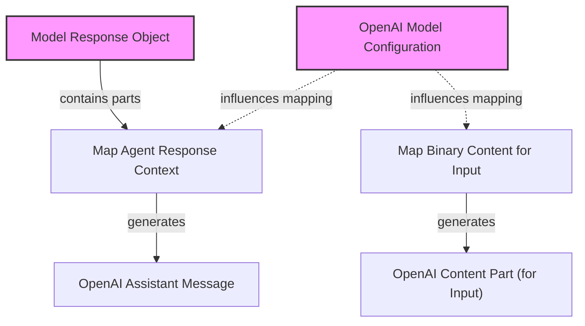

# openai_response_mapping

The `openai_response_mapping` module is responsible for bridging the internal `pydantic_ai_slim` model response structures and binary content representations with the specific data formats required by the OpenAI API for chat completions. It ensures that the rich, multi-part responses generated by the agent can be correctly serialized into an OpenAI-compatible assistant message, and that diverse binary inputs (like images and audio) are properly formatted for user prompts.

This module is critical for enabling seamless communication with OpenAI models, allowing for complex agent outputs to be expressed accurately and for multimodal inputs to be processed effectively.

## Architecture

<!-- DIAGRAM_JSON
{
    "direction": "TD",
    "nodes": [
        {"id": "map_response_context", "label": "Map Agent Response Context", "type": "component", "link": null},
        {"id": "map_binary_content", "label": "Map Binary Content for Input", "type": "component", "link": null},
        {"id": "openai_config", "label": "OpenAI Model Configuration", "type": "external", "link": "openai_model_configuration.md"},
        {"id": "model_response_obj", "label": "Model Response Object", "type": "external", "link": "model_core_interfaces.md"},
        {"id": "output_assistant_message", "label": "OpenAI Assistant Message", "type": "output", "link": null},
        {"id": "output_content_part", "label": "OpenAI Content Part (for Input)", "type": "output", "link": null}
    ],
    "edges": [
        {"source": "model_response_obj", "target": "map_response_context", "label": "contains parts"},
        {"source": "map_response_context", "target": "output_assistant_message", "label": "generates"},
        {"source": "map_binary_content", "target": "output_content_part", "label": "generates"},
        {"source": "openai_config", "target": "map_response_context", "label": "influences mapping", "style": "dashed"},
        {"source": "openai_config", "target": "map_binary_content", "label": "influences mapping", "style": "dashed"}
    ],
    "groups": []
}
-->

## Components

### `_MapModelResponseContext`

The `_MapModelResponseContext` class is a pivotal component responsible for transforming a `ModelResponse` object, which encapsulates various parts of an agent's output, into a single, cohesive `ChatCompletionAssistantMessageParam` compatible with the OpenAI API. This class is designed for extensibility, allowing for custom logic by subclassing.

#### Key Responsibilities:

*   **Aggregating Response Parts**: It iterates through different types of `ModelResponse` parts (e.g., `TextPart`, `ThinkingPart`, `ToolCallPart`, `FilePart`) and collects their content into internal fields like `texts`, `thinkings`, and `tool_calls`.
*   **Flexible Output Construction**: The `_into_message_param` method assembles the collected parts into the final `ChatCompletionAssistantMessageParam`. This method can be overridden to customize the output message structure.
*   **Thinking Part Handling**: It intelligently processes `ThinkingPart` objects, using the `OpenAIModelProfile` to determine whether to include thinking as inline text with tags, as a custom field, or automatically detect the appropriate method based on the source of the thinking.
*   **Tool Call Mapping**: It maps internal `ToolCallPart` objects to OpenAI's `ChatCompletionMessageFunctionToolCallParam` format using a model-specific mapping function.
*   **Extensibility**: Provides hooks (`_map_response_text_part`, `_map_response_thinking_part`, etc.) that can be overridden in subclasses to introduce custom handling for specific part types.

#### Usage Flow:

1.  An instance of `_MapModelResponseContext` is initialized with an `OpenAIChatModel`.
2.  The `map_assistant_message` method is called with a `ModelResponse` object.
3.  The method iterates through each part of the `ModelResponse`.
4.  Based on the type of part, a corresponding `_map_response_*_part` method is invoked to process and store the content.
5.  Finally, `_into_message_param` is called to construct and return the OpenAI `ChatCompletionAssistantMessageParam`.

### `_map_binary_content_item`

The `_map_binary_content_item` asynchronous function handles the conversion of `BinaryContent` objects into `ChatCompletionContentPartParam` objects, which are used to represent rich content (like images, audio, or documents) within user prompts for OpenAI chat completions.

#### Key Responsibilities:

*   **Type-Specific Mapping**: It identifies the media type of the `BinaryContent` and maps it to the appropriate OpenAI content part type.
*   **Inline Text**: For text-like binary content (e.g., `text/plain`), it inlines the content as a text block.
*   **Image Handling**: Converts image binary content into `ChatCompletionContentPartImageParam`, allowing for detail levels (auto, low, high) to be specified via vendor metadata.
*   **Audio Handling**: Maps audio binary content to `ChatCompletionContentPartInputAudioParam`, supporting both URI and base64 encoding based on the `openai_chat_audio_input_encoding` profile setting.
*   **Document Handling**: Converts document binary content into a `File` content part, including the file data URI and a filename.
*   **Error Handling**: Raises `NotImplementedError` for unsupported content types like video.

#### Usage Flow:

1.  The function receives a `BinaryContent` item.
2.  It checks the `media_type` and other properties (`is_image`, `is_audio`, `is_document`).
3.  Based on the type, it constructs and returns the corresponding OpenAI `ChatCompletionContentPartParam` object.

## Related Modules

*   **`openai_model_configuration`**: This module defines the `OpenAIModel` and `OpenAIModelSettings`, which provide the context and configuration (including `OpenAIChatModelProfile`) used by `_MapModelResponseContext` and `_map_binary_content_item` for mapping responses and binary content.
*   **`model_core_interfaces`**: This module defines core model interfaces such as `ModelResponse`, which serves as the input structure for `_MapModelResponseContext` to begin its mapping process.
*   **`agent_output_handling`**: This module defines the various `Part` types (e.g., `TextPart`, `ThinkingPart`, `ToolCallPart`) that are contained within a `ModelResponse` and are processed by `_MapModelResponseContext`.