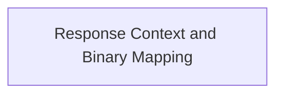

# OpenAI Response Mapping Module

This module is responsible for mapping internal `ModelResponse` objects and binary content items from various sources into the appropriate OpenAI chat completion parameters. It acts as a crucial layer for normalizing and preparing data for interaction with the OpenAI API, ensuring compatibility and correct representation of different response elements such as text, tool calls, and media.

## Architecture Overview

The `openai_response_mapping` module integrates with the broader `openai_model_integration` to process and structure responses. Its primary components focus on transforming raw model output into a format consumable by OpenAI's chat completion endpoints.

<!-- DIAGRAM_JSON
{
    "direction": "TD",
    "nodes": [
        {"id": "response_context_and_binary_mapping", "label": "Response Context and Binary Mapping", "type": "module", "link": "response_context_and_binary_mapping.md"}
    ],
    "edges": [],
    "groups": []
}
-->

## Sub-modules

### [Response Context and Binary Mapping](response_context_and_binary_mapping.md)
This sub-module handles the mapping of OpenAI model responses, including text, tool calls, thinking parts, and binary content like images and audio, into appropriate chat completion parameters. It encompasses the logic for translating different internal `ModelResponse` parts and various binary content types into the specific structures required by the OpenAI API.
