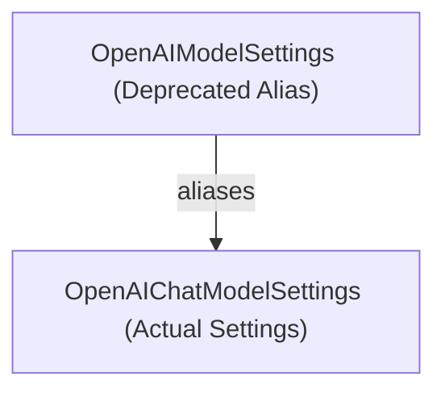

# openai_settings_alias

The `openai_settings_alias` module provides a deprecated alias for OpenAI chat model settings, facilitating backward compatibility during transitions in the Pydantic AI Slim library. It ensures that older configurations referencing `OpenAIModelSettings` continue to function by redirecting to the current `OpenAIChatModelSettings`.

## Core Components

### `OpenAIModelSettings`

`OpenAIModelSettings` serves as a deprecated alias for `OpenAIChatModelSettings`. Its primary role is to maintain compatibility with existing codebases that might still refer to the older naming convention for OpenAI chat model configurations. New implementations should directly use `OpenAIChatModelSettings` for configuring OpenAI chat models.

For more details on the actual settings and configurations, refer to the [openai_model_definitions.md](openai_model_definitions.md) documentation.

<!-- DIAGRAM_JSON
{
    "direction": "TD",
    "nodes": [
        {"id": "openai_model_settings", "label": "OpenAIModelSettings (Deprecated Alias)", "type": "component", "link": null},
        {"id": "openai_chat_model_settings", "label": "OpenAIChatModelSettings (Actual Settings)", "type": "external", "link": "openai_model_definitions.md"}
    ],
    "edges": [
        {"source": "openai_model_settings", "target": "openai_chat_model_settings", "label": "aliases"}
    ]
}
-->
