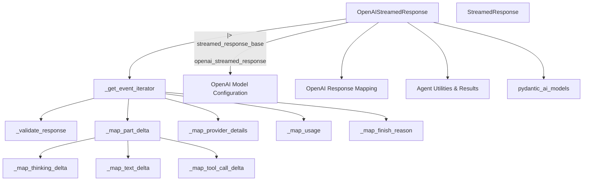

# `openai_streaming_responses` Module Documentation

## Introduction

This module provides the `OpenAIStreamedResponse` class, an implementation of `StreamedResponse` tailored for handling streaming responses from OpenAI models. It is a critical component within the `pydantic_ai_models.openai` integration, responsible for parsing, validating, and mapping streamed data into a standardized event format.

## Purpose and Core Functionality

The primary purpose of the `openai_streaming_responses` module is to manage the lifecycle of a streaming response from an OpenAI large language model. The `OpenAIStreamedResponse` class takes an asynchronous iterable of `ChatCompletionChunk` objects (the raw stream from the OpenAI API) and transforms it into a sequence of `ModelResponseStreamEvent` objects.

Key functionalities include:

-   **Stream Processing**: Iterates through incoming `ChatCompletionChunk` objects from the OpenAI API.
-   **Usage Tracking**: Aggregates and updates token usage statistics, with support for continuous (cumulative) usage reporting.
-   **Model and Provider Information**: Extracts and maintains the model name, provider details, and response timestamps.
-   **Refusal Handling**: Detects and processes refusal messages from content filters, setting the appropriate finish reason and refusal text.
-   **Finish Reason Mapping**: Translates raw finish reasons from OpenAI into a standardized `FinishReason` enum.
-   **Chunk Validation**: Provides a hook (`_validate_response`) for subclasses to implement custom validation logic for incoming chunks.
-   **Delta Mapping**: Orchestrates the mapping of different types of content deltas (thinking, text, tool calls) into `ModelResponseStreamEvent`s using a `ModelResponsePartsManager`.
    -   **Thinking Delta**: Extracts and maps reasoning or thinking content, supporting custom fields defined in `ModelProfile` (e.g., `reasoning`, `reasoning_content`).
    -   **Text Delta**: Processes general text content, handling leading whitespace as configured.
    -   **Tool Call Delta**: Parses and maps tool call information, including tool names, arguments, and call IDs.

This module ensures that raw, diverse streaming responses from OpenAI are consistently processed and presented as a unified stream of events, facilitating further processing by the AI agent system.

## Architecture and Component Relationships

The `openai_streaming_responses` module primarily consists of the `OpenAIStreamedResponse` class and its internal methods, which collectively manage the intricate process of decoding and interpreting the OpenAI streaming protocol.

<!-- DIAGRAM_JSON
{
    "direction": "TD",
    "nodes": [
        {"id": "openai_streamed_response", "label": "OpenAIStreamedResponse", "type": "component", "link": null},
        {"id": "get_event_iterator", "label": "_get_event_iterator", "type": "component", "link": null},
        {"id": "validate_response", "label": "_validate_response", "type": "component", "link": null},
        {"id": "map_part_delta", "label": "_map_part_delta", "type": "component", "link": null},
        {"id": "map_thinking_delta", "label": "_map_thinking_delta", "type": "component", "link": null},
        {"id": "map_text_delta", "label": "_map_text_delta", "type": "component", "link": null},
        {"id": "map_tool_call_delta", "label": "_map_tool_call_delta", "type": "component", "link": null},
        {"id": "map_provider_details_method", "label": "_map_provider_details", "type": "component", "link": null},
        {"id": "map_usage_method", "label": "_map_usage", "type": "component", "link": null},
        {"id": "map_finish_reason_method", "label": "_map_finish_reason", "type": "component", "link": null},
        {"id": "streamed_response_base", "label": "StreamedResponse", "type": "external", "link": "base_model_abstractions.md"},
        {"id": "openai_model_config", "label": "OpenAI Model Configuration", "type": "external", "link": "openai_model_configuration.md"},
        {"id": "openai_response_mapping", "label": "OpenAI Response Mapping", "type": "external", "link": "openai_response_mapping.md"},
        {"id": "agent_utilities_results", "label": "Agent Utilities & Results", "type": "external", "link": "agent_utilities_results.md"},
        {"id": "pydantic_ai_models", "label": "pydantic_ai_models", "type": "external", "link": "pydantic_ai_models.md"}
    ],
    "edges": [
        {"source": "openai_streamed_response", "target": "get_event_iterator"},
        {"source": "get_event_iterator", "target": "validate_response"},
        {"source": "get_event_iterator", "target": "map_usage_method"},
        {"source": "get_event_iterator", "target": "map_finish_reason_method"},
        {"source": "get_event_iterator", "target": "map_provider_details_method"},
        {"source": "get_event_iterator", "target": "map_part_delta"},
        {"source": "map_part_delta", "target": "map_thinking_delta"},
        {"source": "map_part_delta", "target": "map_text_delta"},
        {"source": "map_part_delta", "target": "map_tool_call_delta"},
        {"source": "openai_streamed_response", "target": "streamed_response_base", "label": "inherits"},
        {"source": "openai_streamed_response", "target": "openai_model_config", "label": "uses settings"},
        {"source": "openai_streamed_response", "target": "openai_response_mapping", "label": "uses mapping logic"},
        {"source": "openai_streamed_response", "target": "agent_utilities_results", "label": "uses RequestUsage"},
        {"source": "openai_streamed_response", "target": "pydantic_ai_models", "label": "uses ModelProfile/FinishReason"}
    ],
    "groups": []
}
-->

## How the Module Fits into the Overall System

The `openai_streaming_responses` module is a specialized component within the larger `pydantic_ai_models` ecosystem, specifically handling the interaction with OpenAI's streaming API. It acts as an adapter, translating the raw, vendor-specific streaming format into a generic, event-driven stream (`ModelResponseStreamEvent`) that the rest of the `pydantic_ai` framework can understand and process.

-   **Integration with `base_model_abstractions`**: By inheriting from `StreamedResponse`, it adheres to the core streaming response interface, ensuring consistency across different model integrations.
-   **Dependency on `openai_model_configuration`**: It leverages configuration details like `OpenAIChatModelSettings` and `ModelProfile` to tailor its processing logic, such as enabling continuous usage stats or identifying custom thinking fields.
-   **Collaboration with `openai_response_mapping`**: It utilizes helper functions and contexts from `openai_response_mapping` to handle specific OpenAI response structures, although its primary `_map_` methods are self-contained for direct delta processing.
-   **Output to `agent_utilities_results`**: The module generates `RequestUsage` objects, which are consumed by downstream components for tracking and reporting the cost and activity of AI interactions.
-   **Part of `pydantic_ai_models`**: This module is a key piece of the `pydantic_ai_models` integration layer, enabling `pydantic_ai` to seamlessly consume and interpret streaming responses from OpenAI models, thus facilitating dynamic and interactive AI agent behaviors.
