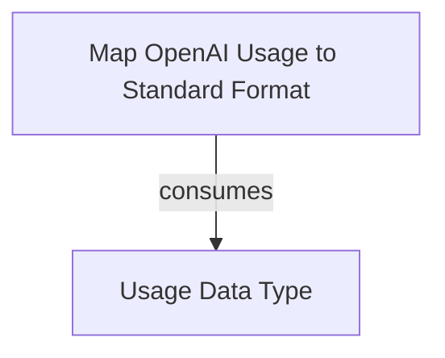

# openai_usage_mapping

The `openai_usage_mapping` module provides the core functionality for translating raw usage data from OpenAI-compatible embedding API responses into a standardized `RequestUsage` format. This standardization is crucial for consistent tracking, reporting, and cost analysis across different model providers.

## Core Components:

### `_map_usage`
*   **Component ID**: `pydantic_ai_slim.pydantic_ai.embeddings.openai._map_usage`
*   **Description**: This function is responsible for converting the `Usage` object, typically returned by OpenAI-compatible APIs, into a more abstract `RequestUsage` object. It handles scenarios where usage data might be missing from the API response and carefully extracts relevant metrics.
*   **Parameters**:
    *   `usage`: An optional `Usage` object (see [agent_utilities.md](agent_utilities.md) for more details on the `Usage` class). Contains raw token usage information (e.g., `prompt_tokens`, `total_tokens`).
    *   `provider`: A string identifying the API provider (e.g., "openai").
    *   `provider_url`: The URL of the API provider.
    *   `model`: The specific model name used for the embedding request.
*   **Returns**: An instance of `RequestUsage`, containing normalized usage statistics and metadata.
*   **Functionality**:
    *   If the input `usage` object is `None`, indicating that the API response did not provide usage details, it returns an empty `RequestUsage` object.
    *   It serializes the `usage` object into a dictionary, excluding `None` values.
    *   It then extracts specific integer-based details from this usage data, excluding `prompt_tokens` and `total_tokens` as these are handled at a higher level during `RequestUsage` extraction.
    *   Finally, it calls the `RequestUsage.extract` method, providing the model name, raw usage data, provider information, and explicitly setting `provider_fallback` to `'openai'` and `api_flavor` to `'embeddings'`, ensuring proper categorization of the usage metrics.

## Architectural Diagram:

<!-- DIAGRAM_JSON
{
    "direction": "TD",
    "nodes": [
        {"id": "map_usage", "label": "Map OpenAI Usage to Standard Format", "type": "component", "link": null},
        {"id": "usage_type", "label": "Usage Data Type", "type": "external", "link": "agent_utilities.md"}
    ],
    "edges": [
        {"source": "map_usage", "target": "usage_type", "label": "consumes"}
    ],
    "groups": []
}
-->

