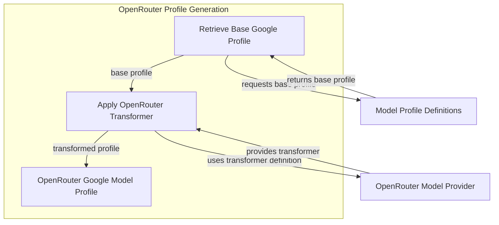

# openrouter_google_profile

The `openrouter_google_profile` module is responsible for generating a `ModelProfile` specifically tailored for Google models when they are accessed through the OpenRouter platform. This module is crucial for ensuring compatibility between Google's model responses and OpenRouter's translation layer, particularly concerning JSON Schema features.

## Module Overview

This module adapts the standard Google model profile to work seamlessly with OpenRouter by applying a specialized JSON schema transformer. This ensures that any specific requirements or limitations of OpenRouter's API for Google models are correctly handled, allowing for robust and consistent interaction.

### Core Components

The primary component within this module is `_openrouter_google_model_profile`.

#### `_openrouter_google_model_profile`

```python
def _openrouter_google_model_profile(model_name: str) -> ModelProfile | None:
    """Get the model profile for a Google model accessed via OpenRouter.

    Uses the legacy transformer to maintain compatibility with OpenRouter's
    translation layer, which doesn't fully support modern JSON Schema features.
    """
    profile = google_model_profile(model_name)
    if profile is None:  # pragma: no cover
        return None
    return replace(profile, json_schema_transformer=_OpenRouterGoogleJsonSchemaTransformer)
```

This function takes a `model_name` as input and first retrieves the default `ModelProfile` for that Google model using `google_model_profile`. If a profile is found, it then modifies this profile by replacing its default `json_schema_transformer` with `_OpenRouterGoogleJsonSchemaTransformer`. This replacement is vital because OpenRouter's current translation layer might not fully support all modern JSON Schema features, and this custom transformer ensures backward compatibility.

## Architecture Diagram

The following diagram illustrates the internal workings of the `openrouter_google_profile` module and its interactions with external components.

<!-- DIAGRAM_JSON
{
    "direction": "TD",
    "nodes": [
        {"id": "get_base_google_profile", "label": "Retrieve Base Google Profile", "type": "component", "link": null},
        {"id": "apply_transformer", "label": "Apply OpenRouter Transformer", "type": "component", "link": null},
        {"id": "output_profile", "label": "OpenRouter Google Model Profile", "type": "component", "link": null},
        {"id": "model_profiles", "label": "Model Profile Definitions", "type": "external", "link": "model_profile_definitions.md"},
        {"id": "openrouter_models", "label": "OpenRouter Model Provider", "type": "external", "link": "model_provider_openrouter.md"}
    ],
    "edges": [
        {"source": "get_base_google_profile", "target": "model_profiles", "label": "requests base profile"},
        {"source": "model_profiles", "target": "get_base_google_profile", "label": "returns base profile"},
        {"source": "get_base_google_profile", "target": "apply_transformer", "label": "base profile"},
        {"source": "apply_transformer", "target": "openrouter_models", "label": "uses transformer definition"},
        {"source": "openrouter_models", "target": "apply_transformer", "label": "provides transformer"},
        {"source": "apply_transformer", "target": "output_profile", "label": "transformed profile"}
    ],
    "groups": [
        {
            "id": "openrouter_profile_generation",
            "label": "OpenRouter Profile Generation",
            "role": "main_process",
            "nodes": ["get_base_google_profile", "apply_transformer", "output_profile"]
        }
    ]
}
-->
