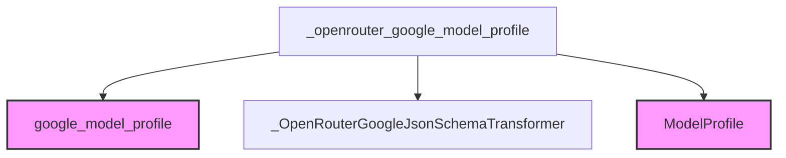

# openrouter_model_configurations

The `openrouter_model_configurations` module is responsible for defining model profiles for Google models that are accessed through the OpenRouter platform. Its primary function is to ensure compatibility by applying a specific JSON Schema transformer that accounts for OpenRouter's translation layer limitations.

## Core Functionality

This module facilitates the integration of Google models with the OpenRouter service by providing a specialized model profile. It leverages an existing Google model profile and then modifies it to include a custom JSON schema transformer. This transformer (`_OpenRouterGoogleJsonSchemaTransformer`) is crucial for handling potential discrepancies or unsupported features in OpenRouter's translation of JSON Schema.

The key component, `_openrouter_google_model_profile`, retrieves a standard Google model profile and overrides its default JSON schema transformer with the OpenRouter-specific one. This ensures that models operate correctly when routed through OpenRouter, maintaining expected behavior despite the intermediary layer.

## Architecture and Component Relationships

The module's architecture is straightforward, focusing on modifying an existing model profile for OpenRouter compatibility.

<!-- DIAGRAM_JSON
{
    "direction": "TD",
    "nodes": [
        {"id": "openrouter_google_profile_func", "label": "_openrouter_google_model_profile", "type": "component", "link": null},
        {"id": "openrouter_google_json_transformer", "label": "_OpenRouterGoogleJsonSchemaTransformer", "type": "component", "link": null},
        {"id": "google_profile_func", "label": "google_model_profile", "type": "external", "link": "google_model_configurations.md"},
        {"id": "model_profile_type", "label": "ModelProfile", "type": "external", "link": "base_model_abstractions.md"}
    ],
    "edges": [
        {"source": "openrouter_google_profile_func", "target": "google_profile_func"},
        {"source": "openrouter_google_profile_func", "target": "openrouter_google_json_transformer"},
        {"source": "openrouter_google_profile_func", "target": "model_profile_type"}
    ],
    "groups": []
}
-->

### Components

*   `_openrouter_google_model_profile`: This function is the entry point for configuring Google models for OpenRouter. It retrieves a base profile and applies the OpenRouter-specific JSON Schema transformer.
*   `_OpenRouterGoogleJsonSchemaTransformer`: An internal helper class responsible for adapting JSON Schema features to be compatible with OpenRouter's translation layer.

### Dependencies

*   **`google_model_profile`**: This function is an external dependency, likely found in the [google_model_configurations.md](google_model_configurations.md) module, providing the foundational model profile for Google models.
*   **`ModelProfile`**: This class, defined in [base_model_abstractions.md](base_model_abstractions.md), represents the structure of a model's capabilities and configurations.

## How it Fits into the Overall System

The `openrouter_model_configurations` module integrates into the broader `pydantic_ai_providers` system by providing a specialized model profile within the `model_profiles` sub-module. It works in conjunction with the [pydantic_ai_models](pydantic_ai_models.md) to ensure that models, particularly Google models accessed via OpenRouter, are correctly configured and operate as expected.

It plays a crucial role in the `pydantic_ai_providers` ecosystem by enabling seamless access to Google models through the OpenRouter service, bridging any compatibility gaps introduced by the intermediary platform. This module ensures that users can leverage Google's AI capabilities through OpenRouter without encountering schema-related issues.