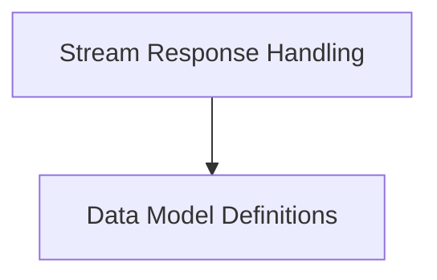

# OpenRouter Model Integration

The `openrouter_model_integration` module provides the necessary components for interacting with OpenRouter models, specifically handling streamed responses and defining the data structures for their API. This module extends the base model abstractions to seamlessly integrate OpenRouter's specific response formats and features, such as `reasoning_details`.

## Architecture Overview

This module is composed of two primary sub-modules: `openrouter_stream_handling` and `openrouter_data_models`. These sub-modules work in conjunction to process and interpret data from OpenRouter's API.

<!-- DIAGRAM_JSON
{
    "direction": "TD",
    "nodes": [
        {"id": "openrouter_stream_handling", "label": "Stream Response Handling", "type": "module", "link": "openrouter_stream_handling.md"},
        {"id": "openrouter_data_models", "label": "Data Model Definitions", "type": "module", "link": "openrouter_data_models.md"}
    ],
    "edges": [
        {"source": "openrouter_stream_handling", "target": "openrouter_data_models"}
    ],
    "groups": []
}
-->

## Sub-modules

### [Stream Response Handling](openrouter_stream_handling.md)
This sub-module is responsible for the intricate details of processing streamed responses from OpenRouter, including custom logic for extracting `reasoning_details` and mapping provider-specific information.

### [Data Model Definitions](openrouter_data_models.md)
This sub-module defines the Pydantic models that represent the structure of OpenRouter API responses. It handles the nuances of nested completion data, ensuring robustness even when fields like `provider` might be unexpectedly null.
