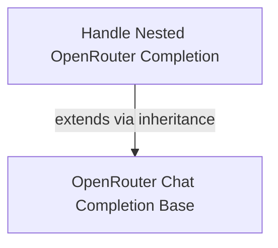

# openrouter_nested_completion Module Documentation

## Introduction

The `openrouter_nested_completion` module is responsible for handling a specific type of completion response from the OpenRouter API. It focuses on parsing and normalizing responses where the `provider` field might be nested or potentially null, ensuring consistency across different OpenRouter model outputs. This module is a specialized component within the broader `model_provider_openrouter` system, which integrates various OpenRouter models.

## Module Overview

This module defines the `_OpenRouterNestedCompletion` class, which extends the base OpenRouter chat completion model. Its primary function is to correctly interpret OpenRouter responses, particularly in scenarios where the structure of the `provider` field might vary. This ensures that downstream components of the system can reliably access provider information.

### Core Components

The `openrouter_nested_completion` module includes the following core component:

*   **`_OpenRouterNestedCompletion`**: This class represents a Pydantic model for OpenRouter completion responses. It includes a `provider` field, which is crucial for identifying the specific model or source of the completion within the OpenRouter ecosystem. A key feature is its `field_validator` for the `provider` field, which automatically coerces `None` or non-string values into the string 'unknown', thus preventing potential errors and ensuring data integrity. It inherits from `_OpenRouterChatCompletion`, integrating seamlessly with the existing OpenRouter model handling logic.

## Architecture

The `openrouter_nested_completion` module operates as a specialized data model within the OpenRouter model integration. It builds upon a foundational chat completion model, adding specific handling for nested or potentially missing provider information.

<!-- DIAGRAM_JSON
{
    "direction": "TD",
    "nodes": [
        {"id": "nested_completion", "label": "Handle Nested OpenRouter Completion", "type": "component", "link": null},
        {"id": "base_chat_completion", "label": "OpenRouter Chat Completion Base", "type": "external", "link": "openrouter_streaming_response.md"}
    ],
    "edges": [
        {"source": "nested_completion", "target": "base_chat_completion", "label": "extends via inheritance"}
    ]
}
-->

### Component Relationships

*   **Handle Nested OpenRouter Completion (`_OpenRouterNestedCompletion`)**: This component is responsible for processing OpenRouter API responses. It is specifically designed to handle variations in the `provider` field, ensuring that it is always a string and defaults to 'unknown' if not explicitly provided or if its value is null.
*   **OpenRouter Chat Completion Base**: The `_OpenRouterNestedCompletion` class extends a base chat completion class, which is part of the `openrouter_streaming_response` module. This inheritance allows `_OpenRouterNestedCompletion` to leverage the core functionalities for OpenRouter chat completions while adding its specialized handling for nested provider information.

## Integration with Other Modules

The `openrouter_nested_completion` module is a part of the `model_provider_openrouter` family of modules. It relies on the fundamental structures and behaviors defined in the `openrouter_streaming_response` module for its base functionalities. Its normalized output can then be consumed by other parts of the `pydantic_ai_agent_core` that process model responses and require consistent provider identification.