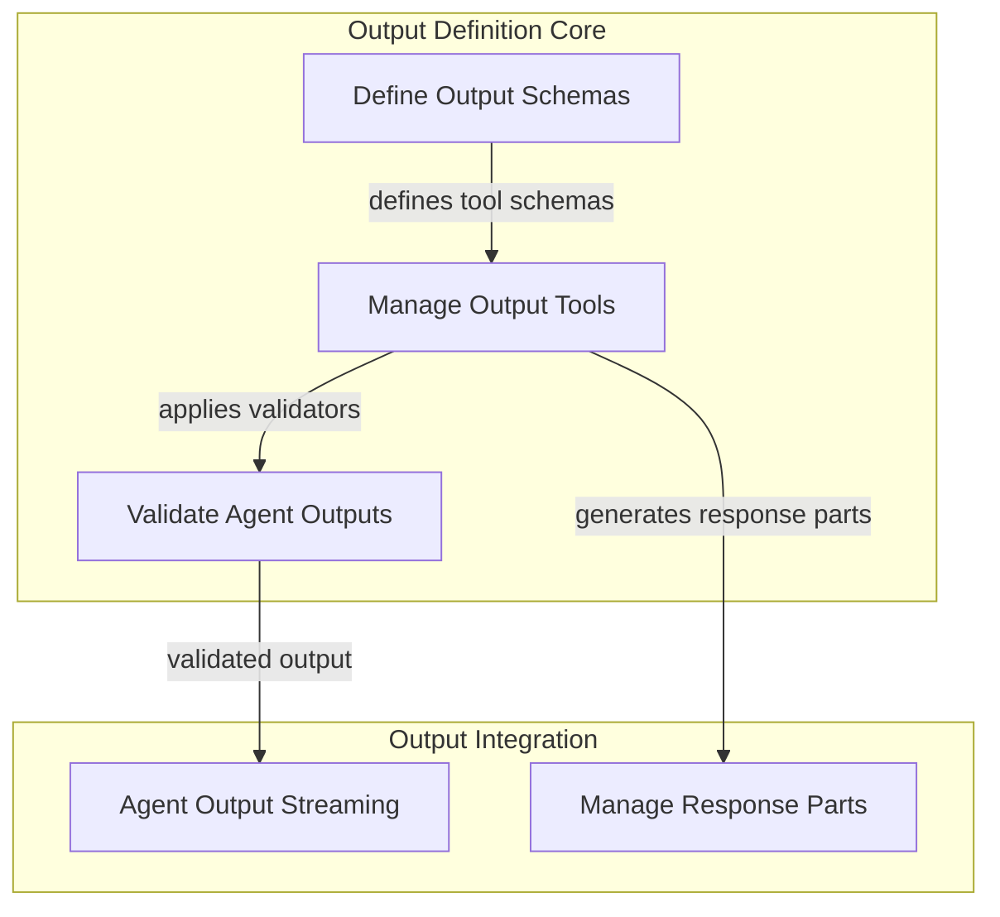

# Output Definition and Validation Module

## Introduction

The `output_definition_and_validation` module is a crucial component within the `pydantic_ai_agent_core` system, specifically residing within the `agent_output_handling` sub-module. Its primary purpose is to define, manage, and validate the various types of outputs that an AI agent can produce. This ensures that agent responses are well-structured, conform to specified schemas, and can be processed effectively by downstream systems or presented to users.

This module provides the foundational mechanisms for agents to declare their output capabilities, whether it's structured data, natural language text, or tool calls. It also enforces data integrity and correctness through a flexible validation system, handling potential errors and enabling retry logic.

## Architecture Overview

The `output_definition_and_validation` module is composed of three key sub-modules, each responsible for a distinct aspect of output management:

<!-- DIAGRAM_JSON
{
    "direction": "TD",
    "nodes": [
        {
            "id": "output_definition_and_validation",
            "label": "Output Definition & Validation",
            "type": "module"
        },
        {
            "id": "output_schema_definition",
            "label": "Define Output Schemas",
            "type": "module",
            "link": "output_schema_definition.md"
        },
        {
            "id": "output_toolset_management",
            "label": "Manage Output Tools",
            "type": "module",
            "link": "output_toolset_management.md"
        },
        {
            "id": "output_validation_logic",
            "label": "Validate Agent Outputs",
            "type": "module",
            "link": "output_validation_logic.md"
        },
        {
            "id": "agent_output_streaming",
            "label": "Agent Output Streaming",
            "type": "module",
            "link": "agent_output_streaming.md"
        },
        {
            "id": "response_part_management",
            "label": "Manage Response Parts",
            "type": "module",
            "link": "response_part_management.md"
        }
    ],
    "edges": [
        {
            "source": "output_schema_definition",
            "target": "output_toolset_management",
            "label": "defines tool schemas"
        },
        {
            "source": "output_toolset_management",
            "target": "output_validation_logic",
            "label": "applies validators"
        },
        {
            "source": "output_validation_logic",
            "target": "agent_output_streaming",
            "label": "validated output"
        },
        {
            "source": "output_toolset_management",
            "target": "response_part_management",
            "label": "generates response parts"
        }
    ],
    "groups": [
        {
            "id": "output_definition_core",
            "label": "Output Definition Core",
            "role": "generative",
            "nodes": [
                "output_schema_definition",
                "output_toolset_management",
                "output_validation_logic"
            ]
        },
        {
            "id": "output_integration",
            "label": "Output Integration",
            "role": "data",
            "nodes": [
                "agent_output_streaming",
                "response_part_management"
            ]
        }
    ]
}
-->

## Sub-modules and their Functionality

### [Output Schema Definition](output_schema_definition.md)
This sub-module is responsible for defining the various types of output schemas an agent can utilize. It provides abstract and concrete classes for handling different output formats, including raw text, structured data via tools, and even binary images. This flexibility allows developers to precisely specify the expected output format of an agent.

### [Output Toolset Management](output_toolset_management.md)
This sub-module manages the creation and configuration of toolsets specifically designed for handling agent outputs. It translates defined output schemas into callable tools that the agent can use to construct its responses. It also handles retry mechanisms for tool calls, ensuring robustness in output generation.

### [Output Validation Logic](output_validation_logic.md)
The `output_validation_logic` sub-module provides the necessary components to validate the agent's generated outputs against predefined rules and constraints. It ensures that the output data adheres to the specified schema and business logic. In cases of validation failure, it can trigger retry mechanisms or generate informative error messages.

## Connections to other Modules

This module is tightly integrated with other parts of the `pydantic_ai_agent_core` system, particularly within the `agent_output_handling` parent module:

*   **[Agent Output Streaming](agent_output_streaming.md)**: Validated outputs from this module are typically streamed to the user or downstream systems via the `agent_output_streaming` module.
*   **[Response Part Management](response_part_management.md)**: The `output_toolset_management` sub-module works in conjunction with `response_part_management` to assemble the various parts of an agent's response, especially when dealing with complex structured outputs or interleaved content. This includes managing how different segments of an agent's response are collected and formatted before delivery.

By centralizing output definition, tool management, and validation, this module ensures a robust and predictable output pipeline for AI agents, critical for reliable and effective agent operations.