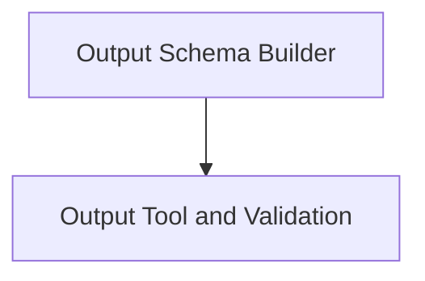

# Output Processing and Validation

The `output_processing_validation` module, a core component within the `tool_output_management` section of `pydantic_ai_agent_core`, is responsible for defining, building, and validating the structured outputs generated by AI agents. It ensures that agent responses conform to predefined schemas and handles the integration of output-specific tools and validation logic.

## Architecture Overview
The module is structured into two main sub-modules: `output_schema_builder` and `output_tool_validation`. These work together to manage the lifecycle of agent outputs from definition to final validation.

<!-- DIAGRAM_JSON
{
    "direction": "TD",
    "nodes": [
        {"id": "output_schema_builder", "label": "Output Schema Builder", "type": "module", "link": "output_schema_builder.md"},
        {"id": "output_tool_validation", "label": "Output Tool and Validation", "type": "module", "link": "output_tool_validation.md"}
    ],
    "edges": [
        {"source": "output_schema_builder", "target": "output_tool_validation"}
    ],
    "groups": []
}
-->

## Sub-module Functionality

*   **Output Schema Builder ([output_schema_builder.md](output_schema_builder.md)):** This sub-module focuses on the `OutputSchema` component, which is critical for defining the expected structure and types of agent outputs. It handles various output configurations, including support for deferred tools and image outputs, ensuring that agent responses are well-formed according to specified requirements.

*   **Output Tool and Validation ([output_tool_validation.md](output_tool_validation.md)):** This sub-module integrates the `OutputToolset` and `OutputValidator` components. It manages the creation and execution of specialized tools for handling agent outputs, and provides robust validation mechanisms to ensure that the processed outputs meet predefined criteria before being finalized or returned.
