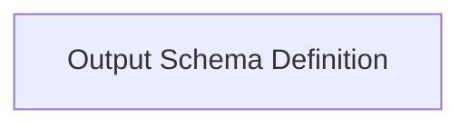

<!-- AUTO_GENERATED_PLACEHOLDER
  reason: LLM did not create .md file for this module
  module_path: pydantic_ai_agent_core/agent_output_handling/output_definition_and_validation/output_schema_definition
  component_count: 1
  generated_at: 2026-04-06T06:47:34.929719
  TODO: Fix LLM prompt to handle small leaf modules
-->

# Output Schema Definition

> ⚠️ **Auto-Generated Placeholder**
> This documentation was auto-generated because the LLM failed to create it.
> Module path: `pydantic_ai_agent_core/agent_output_handling/output_definition_and_validation/output_schema_definition`

Defines the abstract and concrete classes for various output schemas, including text, tool, and image outputs, allowing flexible output specification for agents.

## Components

This module contains 1 component(s):

- `pydantic_ai_slim.pydantic_ai._output.OutputSchema`

## Structure

---
*Auto-generated placeholder. See sync_issues.json for details.*
