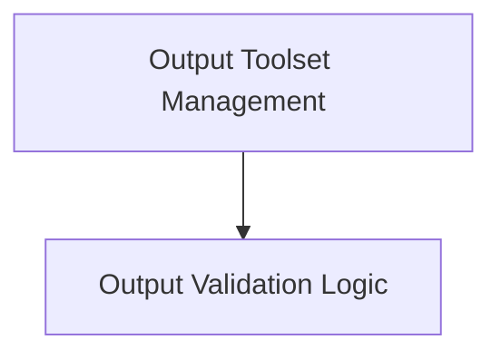

# Output Tool Validation Module

The `output_tool_validation` module is a crucial component within the `pydantic_ai_agent_core` that focuses on managing and validating the outputs generated by AI agents. It ensures that agent outputs conform to defined schemas and business logic, providing robust mechanisms for tool definition, execution, and validation.

## Architecture Overview

This module is composed of two primary sub-modules, `output_toolset_management` and `output_validation_logic`, which work in conjunction to provide a comprehensive output handling system for AI agents.

<!-- DIAGRAM_JSON
{
    "direction": "TD",
    "nodes": [
        {"id": "output_toolset_management", "label": "Output Toolset Management", "type": "module", "link": "output_toolset_management.md"},
        {"id": "output_validation_logic", "label": "Output Validation Logic", "type": "module", "link": "output_validation_logic.md"}
    ],
    "edges": [
        {"source": "output_toolset_management", "target": "output_validation_logic"}
    ],
    "groups": []
}
-->

## Sub-modules

### [Output Toolset Management](output_toolset_management.md)
This sub-module is responsible for the creation, definition, and execution of agent output tools. It includes mechanisms for handling tool definitions, processors, and managing retry logic for tool calls.

### [Output Validation Logic](output_validation_logic.md)
This sub-module provides the core logic for validating the results of agent output tools. It supports both synchronous and asynchronous validation functions and integrates with retry mechanisms to ensure data integrity and correctness.