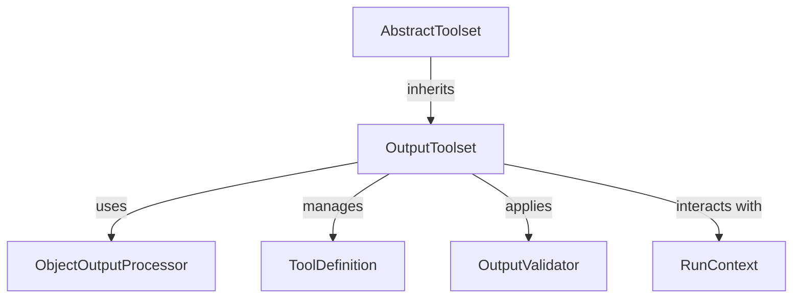

# Output Toolset Management Module

The `output_toolset_management` module is a crucial part of the AI agent's output handling system. It is responsible for defining, building, and managing the toolsets that represent the valid output structures an AI agent can produce. This ensures that the agent's responses adhere to predefined schemas and can be properly validated and processed.

## Purpose and Core Functionality

The primary component of this module is the `OutputToolset` class. It extends `AbstractToolset` and specializes in encapsulating a collection of "output tools," where each tool corresponds to a specific output type or schema defined for the agent.

### `OutputToolset` Class

`OutputToolset` manages the lifecycle and execution of output tools. Its core functionalities include:

*   **Building Output Tools**: The `build` class method constructs an `OutputToolset` from a list of output type definitions (`OutputTypeOrFunction` or `ToolOutput`). It intelligently names tools, generates descriptions, and sets up `ObjectOutputProcessor` instances for each output type.
*   **Output Processing**: Each output tool is associated with an `ObjectOutputProcessor` which handles the actual processing and validation of the output data against its defined schema.
*   **Output Validation**: The `OutputToolset` can be configured with `OutputValidator` instances that are applied sequentially to the output after it has been processed by the `ObjectOutputProcessor`, providing an additional layer of validation or transformation.
*   **Retry Mechanism**: It supports configurable maximum retries for output tools, allowing for robust error handling during output generation.
*   **Tool Exposure**: The `get_tools` method exposes the defined output tools, making them accessible to the agent's execution graph.
*   **Tool Invocation**: The `call_tool` method executes a specific output tool, processes its arguments, and applies any configured output validators.

## Architecture and Component Relationships

The `output_toolset_management` module, specifically the `OutputToolset`, interacts with several key components to achieve its functionality:

*   **`ObjectOutputProcessor`**: An internal helper component that takes an output type (e.g., a Pydantic model) and generates its schema, providing validation capabilities for arguments passed to an output tool.
*   **`ToolDefinition`**: Represents the schema and metadata for a single tool, including its name, description, and JSON schema for parameters.
*   **`OutputValidator`**: An external component (see [output_validation_logic.md](output_validation_logic.md)) that performs post-processing or additional validation on the output produced by an output tool.
*   **`AbstractToolset`**: The base class for `OutputToolset` (defined in [tool_output_management.md](tool_output_management.md)), providing the common interface for toolset management.
*   **`RunContext`**: An external component (from [pydantic_ai_agent_core.md](pydantic_ai_agent_core.md)) providing the context for the agent's execution, used during tool invocation.

<!-- DIAGRAM_JSON
{
    "direction": "TD",
    "nodes": [
        {"id": "output_toolset_management", "label": "OutputToolset", "type": "component", "link": null},
        {"id": "object_output_processor", "label": "ObjectOutputProcessor", "type": "component", "link": null},
        {"id": "tool_definition", "label": "ToolDefinition", "type": "component", "link": null},
        {"id": "output_validator", "label": "OutputValidator", "type": "external", "link": "output_validation_logic.md"},
        {"id": "abstract_toolset", "label": "AbstractToolset", "type": "external", "link": "tool_output_management.md"},
        {"id": "run_context", "label": "RunContext", "type": "external", "link": "pydantic_ai_agent_core.md"}
    ],
    "edges": [
        {"source": "abstract_toolset", "target": "output_toolset_management", "label": "inherits"},
        {"source": "output_toolset_management", "target": "object_output_processor", "label": "uses"},
        {"source": "output_toolset_management", "target": "tool_definition", "label": "manages"},
        {"source": "output_toolset_management", "target": "output_validator", "label": "applies"},
        {"source": "output_toolset_management", "target": "run_context", "label": "interacts with"}
    ],
    "groups": []
}
-->

## How the Module Fits into the Overall System

The `output_toolset_management` module is an integral part of the `pydantic_ai_agent_core`'s `tool_output_management` subsystem, specifically within `output_processing_validation`. It provides the foundational mechanism for defining and enforcing the structured outputs of an AI agent. By allowing agents to declare their output formats as tools, this module facilitates:

*   **Structured Responses**: Ensures that agent responses conform to well-defined Pydantic schemas, which is crucial for downstream processing and integration.
*   **Validation Pipeline**: Integrates with `OutputValidator` to create a robust validation pipeline for agent outputs, enhancing reliability and correctness.
*   **Tool-based Output**: Aligns output handling with the general tool-use paradigm of the AI agent, making output specification consistent with how other tools are defined and managed.

This module is critical for agents that need to produce reliable, parseable, and validated outputs, enabling seamless interaction with other system components or external services.