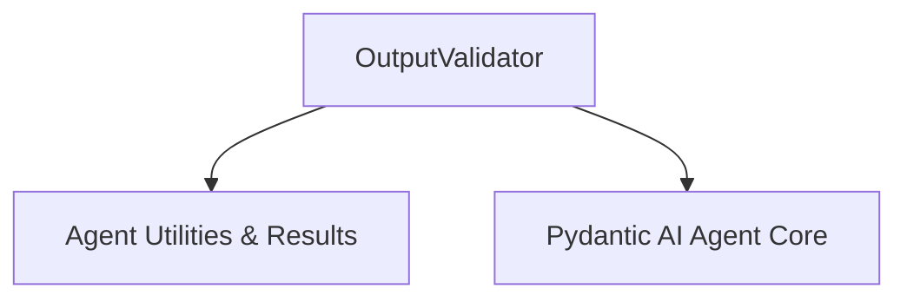

# `output_validation_logic` Module Documentation

## Introduction

The `output_validation_logic` module, residing within the `pydantic_ai_slim.pydantic_ai._output` package, is responsible for enforcing validation rules on the outputs generated by AI models or tools. Its primary component, `OutputValidator`, ensures that results conform to expected schemas and business logic before further processing or delivery. This module is a critical part of the overall agent execution flow, specifically within the output processing and validation sub-system.

## Architecture and Core Components

At the heart of this module is the `OutputValidator` class, which orchestrates the validation process. It integrates with runtime contexts and utility functions to handle diverse validation scenarios, including asynchronous validation logic and error handling with retry mechanisms.

### `OutputValidator`

The `OutputValidator` class is a generic class designed to validate results of a specified type (`T`) using a provided validation function. It supports both synchronous and asynchronous validation functions and can optionally accept a `RunContext` for contextual validation.

**Key responsibilities of `OutputValidator`:**
-   **Function Registration**: It takes an `OutputValidatorFunc` (a callable) during initialization, which embodies the specific validation logic.
-   **Asynchronous and Synchronous Handling**: It automatically detects whether the provided validation function is asynchronous or synchronous and executes it accordingly. For synchronous functions, it leverages an executor to avoid blocking the event loop.
-   **Contextual Validation**: It can pass the `RunContext` to the validation function if the function signature indicates it accepts it, allowing for context-aware validation (e.g., accessing agent dependencies or tool-specific information).
-   **Error Handling and Retries**: In case of a `ModelRetry` exception raised by the validation function, it wraps this into a `ToolRetryError` containing a `RetryPromptPart` message, signaling to the calling system that the output needs to be re-attempted or that the user needs to be prompted for more information. This is crucial for guiding the AI agent to correct its output.

## How it Fits into the Overall System

The `output_validation_logic` module is a leaf module within the `pydantic_ai_agent_core`'s `tool_output_management` sub-system. It specifically underpins the `output_tool_validation` process, ensuring that any output from a tool or model is rigorously checked before being consumed by subsequent steps in the agent's workflow.

It depends on utility functions from the `agent_utilities_results` module for async/sync execution management and interacts closely with the broader `pydantic_ai_agent_core` for `RunContext` and message handling. This module's validation capabilities are essential for building robust and reliable AI agents that can self-correct or provide meaningful feedback upon invalid outputs.

<!-- DIAGRAM_JSON
{
    "direction": "TD",
    "nodes": [
        {"id": "output_validator", "label": "OutputValidator", "type": "component", "link": null},
        {"id": "agent_utilities_results", "label": "Agent Utilities & Results", "type": "external", "link": "agent_utilities_results.md"},
        {"id": "pydantic_ai_agent_core", "label": "Pydantic AI Agent Core", "type": "external", "link": "pydantic_ai_agent_core.md"}
    ],
    "edges": [
        {"source": "output_validator", "target": "agent_utilities_results"},
        {"source": "output_validator", "target": "pydantic_ai_agent_core"}
    ],
    "groups": []
}
-->

