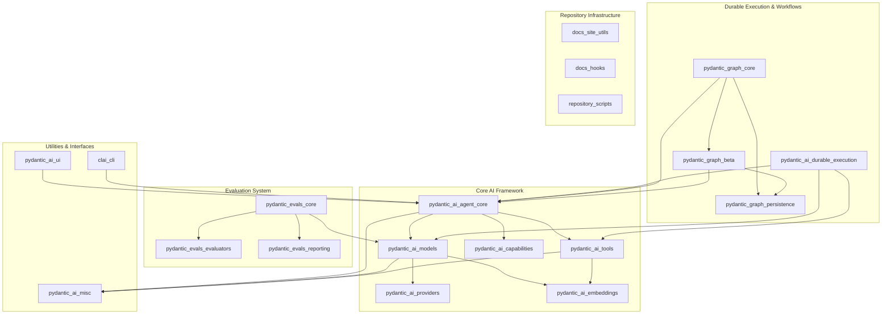

The `pydantic-ai-src` repository provides a comprehensive framework for building, evaluating, and deploying AI agents and models, leveraging Pydantic for structured data. It encompasses core agent orchestration, model integrations with various providers, a rich set of tools and capabilities, durable execution mechanisms, graph-based workflow management, and a robust evaluation system. Additionally, it includes utilities for UI, CLI, and repository maintenance.

### Architecture Overview

The repository is structured into several key functional areas, each comprising multiple modules that work together to deliver a complete AI development and deployment ecosystem. The core AI framework forms the foundation, supported by specialized modules for durable execution, graph-based workflows, and a dedicated evaluation system. User interaction is facilitated through UI and CLI modules, while miscellaneous utilities and repository infrastructure modules provide essential support.

