The `pydantic-ai-src` repository offers a comprehensive framework for building, evaluating, and deploying intelligent AI agents. It empowers developers to define complex agent behaviors, integrate with diverse Large Language Models (LLMs) and embedding services, incorporate various tools, enable durable execution, and connect to interactive user interfaces. Additionally, it provides a robust evaluation system to define structured datasets, implement various metrics, and orchestrate both offline and real-time online evaluations, ensuring continuous monitoring and improvement of AI performance. It's designed for developers and researchers who need structured, observable, and reliable AI systems.

### Key User Workflows

1.  **Build & Orchestrate AI Agents**: Users define agent specifications, capabilities, and tools, then orchestrate their execution through a graph-based workflow, handling inputs, processing steps, and managing outputs.
2.  **Integrate Diverse AI Models & Tools**: Connect to a wide array of LLM providers, embedding models, and external/internal tools via a unified interface, leveraging Pydantic for structured data handling.
3.  **Evaluate AI System Performance**: Create and manage datasets, execute various evaluators (from simple checks to complex statistical analyses), and generate reports to assess and improve AI model and agent quality.
4.  **Develop & Document**: Utilize developer tools for testing, verification, and manage comprehensive, searchable documentation for the entire project.

### Architecture Overview

```mermaid
flowchart LR
    user(("User"))
    user ==>|"configures"| DefineAgent
    user ==>|"interacts with"| UserInterface
    user ==>|"initiates"| RunEvaluations
    user ==>|"develops with"| UseDevTools

    subgraph agent_core["Agent Core & Orchestration"]
        DefineAgent["Define Agent Behavior"]
        OrchestrateFlow["Orchestrate Agent Workflow"]
        ManageCapabilities["Manage Agent Capabilities"]
        HandleOutput["Process Agent Output"]
        RunDurableAgent["Run Durable Agent"]
    end

    subgraph ai_ecosystem["AI Model & Tool Ecosystem"]
        ConnectLLMs["Connect to LLM Providers"]
        UseEmbeddings["Generate Embeddings"]
        ManageToolsets["Manage Toolsets & Tools"]
        ExternalTools["Integrate External Toolsets"]
        BuiltinTools["Access Built-in Tools"]
    end

    subgraph evaluation["Evaluation & Reporting"]
        DefineDatasets["Define & Generate Datasets"]
        RunEvaluations["Execute Evaluations"]
        AnalyzeReports["Analyze Reports & Metrics"]
        EvaluatorLogic["Implement Evaluator Logic"]
    end

    subgraph project_support["Project Support & UI"]
        UserInterface["Interact via UI"]
        BrowseDocs["Browse Documentation"]
        UseDevTools["Use Developer Utilities"]
        SearchDocs["Search Documentation"]
    end

    subgraph data_storage["Stored Data"]
        AgentState[("Agent State")]
        EvalResults[("Evaluation Results")]
        DocsContent[("Documentation Content")]
        SearchIndex[("Search Index")]
    end

    %% Agent Core & Orchestration internal connections
    DefineAgent -->|"defines workflow"| OrchestrateFlow
    DefineAgent -->|"configures"| ManageCapabilities
    ManageCapabilities -->|"enables"| OrchestrateFlow
    OrchestrateFlow -->|"produces"| HandleOutput
    RunDurableAgent -.->|"wraps execution"| OrchestrateFlow

    %% AI Model & Tool Ecosystem internal connections
    ExternalTools -->|"extends"| ManageToolsets
    BuiltinTools -->|"provides"| ManageToolsets

    %% Evaluation & Reporting internal connections
    RunEvaluations -->|"uses"| DefineDatasets
    RunEvaluations -->|"applies"| EvaluatorLogic
    AnalyzeReports -->|"reads"| EvalResults

    %% Project Support & UI internal connections
    BrowseDocs -->|"queries"| SearchDocs

    %% Cross-group connections
    OrchestrateFlow -->|"requests LLM/Tool"| ConnectLLMs
    ConnectLLMs -->|"returns response"| OrchestrateFlow
    ManageToolsets -->|"provides callable"| OrchestrateFlow
    UseEmbeddings -->|"provides vectors"| ManageCapabilities

    OrchestrateFlow -->|"persists state"| AgentState
    AgentState -->|"restores state"| OrchestrateFlow

    HandleOutput -.->|"provides agent output"| RunEvaluations
    ConnectLLMs -.->|"provides model output"| RunEvaluations

    UserInterface -->|"sends commands"| OrchestrateFlow
    HandleOutput -->|"streams output"| UserInterface

    UseDevTools -->|"generates"| DocsContent
    DocsContent -->|"indexed by"| SearchDocs
    DocsContent -->|"served by"| BrowseDocs
    SearchDocs -->|"updates"| SearchIndex
    SearchIndex -->|"used by"| BrowseDocs

    RunEvaluations -->|"writes"| EvalResults

    classDef userNode fill:#fef3c7,stroke:#d97706,stroke-width:2px,color:#92400e
    classDef surface fill:#dbeafe,stroke:#3b82f6,stroke-width:2px,color:#1e3a5f
    classDef data fill:#d1fae5,stroke:#10b981,stroke-width:2px,color:#065f46
    classDef generative fill:#fed7aa,stroke:#ea580c,stroke-width:1px,color:#7c2d12
    classDef analytical fill:#ede9fe,stroke:#8b5cf6,stroke-width:1px,color:#4c1d95

    class user userNode
    class DefineAgent,OrchestrateFlow,ManageCapabilities,HandleOutput,RunDurableAgent generative
    class ConnectLLMs,UseEmbeddings,ManageToolsets,ExternalTools,BuiltinTools data
    class DefineDatasets,RunEvaluations,AnalyzeReports,EvaluatorLogic analytical
    class UserInterface,BrowseDocs,UseDevTools,SearchDocs surface
    class AgentState,EvalResults,DocsContent,SearchIndex data

    click DefineAgent "agent_definition.md" "View Agent Definition"
    click OrchestrateFlow "agent_execution_graph.md" "View Agent Execution Graph"
    click ManageCapabilities "capabilities_base.md" "View Capabilities Base"
    click HandleOutput "agent_output_handling.md" "View Agent Output Handling"
    click RunDurableAgent "durable_execution_temporal.md" "View Durable Execution with Temporal"

    click ConnectLLMs "model_provider_integrations.md" "View Model Provider Integrations"
    click UseEmbeddings "embedding_core.md" "View Embedding Core"
    click ManageToolsets "toolset_management.md" "View Toolset Management"
    click ExternalTools "external_toolset_integrations.md" "View External Toolset Integrations"
    click BuiltinTools "builtin_tools.md" "View Built-in Tools"

    click DefineDatasets "dataset_management.md" "View Dataset Management"
    click RunEvaluations "online_evaluation_system.md" "View Online Evaluation System"
    click AnalyzeReports "reporting_and_rendering.md" "View Reporting and Rendering"
    click EvaluatorLogic "evaluator_core.md" "View Evaluator Core"

    click UserInterface "ui_vercel_ai_adapter.md" "View Vercel AI Adapter"
    click BrowseDocs "documentation_site_management.md" "View Documentation Site Management"
    click UseDevTools "developer_utility_scripts.md" "View Developer Utility Scripts"
    click SearchDocs "search_and_indexing.md" "View Search and Indexing"
```

