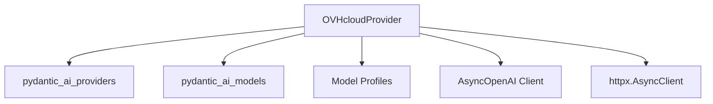

# ovhcloud_provider

## Introduction
The `ovhcloud_provider` module integrates OVHcloud AI Endpoints as a provider for the AI agent system. It enables the system to interact with various large language models hosted on OVHcloud's infrastructure, leveraging their OpenAI-compatible API.

## Core Functionality
The `ovhcloud_provider` module provides the `OVHcloudProvider` class, which serves as an adapter to interact with OVHcloud AI Endpoints. It handles API key management, constructs the base URL for the OVHcloud API, and provides a mechanism to map model names to appropriate model profiles for consistent interaction within the AI agent framework.

### `OVHcloudProvider` Class
The `OVHcloudProvider` class is responsible for:
*   **Provider Identification**: Returning the name 'ovhcloud' for identification.
*   **Base URL Configuration**: Defining the endpoint URL for OVHcloud AI services.
*   **Client Management**: Providing an `AsyncOpenAI` client for asynchronous API interactions.
*   **Model Profile Mapping**: Dynamically selecting and updating model profiles based on the requested model name, ensuring compatibility and correct schema transformation.
*   **Initialization**: Managing the API key acquisition (from environment variables or direct parameter) and client instantiation, including support for custom HTTP clients.

## Architecture and Component Relationships

<!-- DIAGRAM_JSON
{
    "direction": "TD",
    "nodes": [
        {"id": "ovhcloud_provider", "label": "OVHcloudProvider", "type": "component", "link": null},
        {"id": "pydantic_ai_providers", "label": "pydantic_ai_providers", "type": "external", "link": "pydantic_ai_providers.md"},
        {"id": "pydantic_ai_models", "label": "pydantic_ai_models", "type": "external", "link": "pydantic_ai_models.md"},
        {"id": "model_profiles", "label": "Model Profiles", "type": "external", "link": "model_profiles.md"},
        {"id": "async_openai_client", "label": "AsyncOpenAI Client", "type": "external", "link": null},
        {"id": "http_client_lib", "label": "httpx.AsyncClient", "type": "external", "link": null}
    ],
    "edges": [
        {"source": "ovhcloud_provider", "target": "pydantic_ai_providers"},
        {"source": "ovhcloud_provider", "target": "pydantic_ai_models"},
        {"source": "ovhcloud_provider", "target": "model_profiles"},
        {"source": "ovhcloud_provider", "target": "async_openai_client"},
        {"source": "ovhcloud_provider", "target": "http_client_lib"}
    ],
    "groups": []
}
-->

### Component Relationships

*   **`OVHcloudProvider`**: The central component of this module, responsible for interfacing with OVHcloud AI Endpoints.
*   **`pydantic_ai_providers`**: The `OVHcloudProvider` extends `Provider` from this module, establishing its role within the broader provider framework.
*   **`pydantic_ai_models`**: This module is crucial for providing `OpenAIModelProfile` and `OpenAIJsonSchemaTransformer`, which are used by `OVHcloudProvider` to ensure model responses are properly structured and compatible with the system's internal representations due to OVHcloud's OpenAI-compatible API. The `AsyncOpenAI` client itself, while an external library, aligns with the model interfaces defined in `pydantic_ai_models`.
*   **`model_profiles`**: This represents the collection of specific model profiles (e.g., `meta_model_profile`, `deepseek_model_profile`, `mistral_model_profile`, `harmony_model_profile`, `qwen_model_profile`) that `OVHcloudProvider` uses to configure the behavior of different LLMs based on their names. These profiles are likely defined within the `pydantic_ai_providers` module or a dedicated `model_profiles` submodule within it.
*   **`AsyncOpenAI Client`**: An external dependency (from the `openai` Python library) used to communicate with the OpenAI-compatible OVHcloud API.
*   **`httpx.AsyncClient`**: An external HTTP client library used by the `AsyncOpenAI` client for making actual network requests. A cached version (`cached_async_http_client`) is also utilized for performance.

## How the module fits into the overall system
The `ovhcloud_provider` module plays a critical role in expanding the AI agent system's capability to utilize cloud-based large language models. By integrating with OVHcloud AI Endpoints, it allows the system to:
*   **Access diverse LLMs**: Leverage various models offered by OVHcloud, enhancing the range of available AI capabilities.
*   **Maintain API compatibility**: Through its `OpenAIModelProfile` and `OpenAIJsonSchemaTransformer` integration, it ensures that OVHcloud's OpenAI-compatible API responses are seamlessly processed by the system.
*   **Abstract provider specifics**: It encapsulates the OVHcloud-specific API interactions, allowing other parts of the system to interact with it through a standardized `Provider` interface (defined in [pydantic_ai_providers.md](pydantic_ai_providers.md)), promoting modularity and ease of adding new providers.
*   **Centralize model configuration**: The `model_profile` static method helps centralize the logic for configuring models based on their names, ensuring consistent behavior across different OVHcloud models.