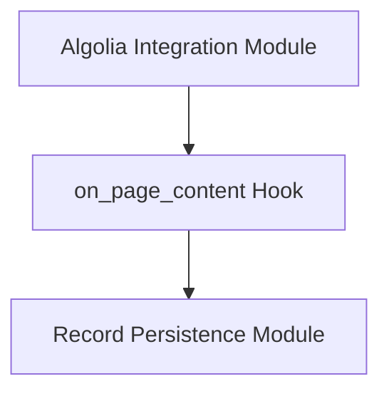

# page_content_processing Module

## Introduction

The `page_content_processing` module is a critical component within the `algolia_integration` ecosystem, specifically designed to prepare and optimize documentation page content for Algolia search indexing. It acts as a pre-processor, transforming raw HTML content into a clean, searchable format and extracting relevant information to create search records.

## Purpose and Core Functionality

The primary purpose of this module is to ensure that the documentation content is appropriately structured and cleaned before being sent to Algolia for indexing. This involves several key functionalities:

1.  **HTML Sanitization**: It cleans up various presentational and UI-specific HTML elements (e.g., `<autoref>`, `
`) that are not relevant for search indexing.
2.  **Code Block Normalization**: It standardizes the representation of code examples, converting different forms of highlighted code blocks and tables from MkDocs' API reference into simple `<pre>` tags, ensuring consistent and readable code snippets in search results.
3.  **Section Extraction and Ranking**: The module identifies logical sections within a page based on `<h1>`, `<h2>`, and `<h3>` headings. For each section, it extracts plain text content and assigns a search `rank`. Higher-level headings (e.g., `<h1>`) receive a higher rank, indicating their increased importance in search results.
4.  **Algolia Record Generation**: For every identified section, it constructs an `AlgoliaRecord` object. Each record includes the cleaned content, the page title, a unique URL (including an anchor for specific sections), and a calculated rank.

## Architecture and Component Relationships

The `page_content_processing` module is centered around the `on_page_content` hook, which is invoked during the MkDocs build process. This function leverages external libraries like `BeautifulSoup` for robust HTML parsing and manipulation.

The `on_page_content` function directly interacts with the MkDocs build environment by receiving the page's HTML content, page metadata, configuration, and files. It then processes this information to generate a list of `AlgoliaRecord` objects.

<!-- DIAGRAM_JSON
{
    "direction": "TD",
    "nodes": [
        {"id": "on_page_content_hook", "label": "on_page_content Hook", "type": "component", "link": null},
        {"id": "algolia_integration", "label": "Algolia Integration Module", "type": "external", "link": "algolia_integration.md"},
        {"id": "record_persistence", "label": "Record Persistence Module", "type": "external", "link": "record_persistence.md"}
    ],
    "edges": [
        {"source": "algolia_integration", "target": "on_page_content_hook"},
        {"source": "on_page_content_hook", "target": "record_persistence"}
    ],
    "groups": []
}
-->

### Core Components

*   `docs..hooks.algolia.on_page_content`: This is the main function of the module. It orchestrates the HTML parsing, cleaning, section extraction, and Algolia record creation process.

## How the Module Fits into the Overall System

The `page_content_processing` module is an integral part of the documentation site's search functionality. It acts as the initial data preparation layer for Algolia.

1.  **Input**: It receives raw HTML content for each documentation page from the MkDocs build process.
2.  **Processing**: It transforms this HTML into structured data suitable for search.
3.  **Output**: It populates a global list of `AlgoliaRecord` objects. This list is then consumed by the [record_persistence](record_persistence.md) module's `on_post_build` function, which is responsible for submitting these records to the Algolia API.

This workflow ensures that only relevant and well-structured content is indexed, leading to more accurate and efficient search results for users of the documentation site.
