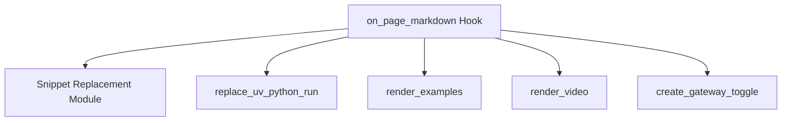

# page_markdown_processing Module Documentation

## Introduction

The `page_markdown_processing` module is a crucial part of the documentation generation pipeline, specifically handling the transformation of Markdown content before it is converted into HTML. It orchestrates several hooks to enrich and modify the raw Markdown, ensuring that the final output includes dynamic elements, code snippets, and proper formatting.

## Purpose and Core Functionality

This module's primary purpose is to process the raw Markdown content of documentation pages. The core functionality is encapsulated within the `on_page_markdown` hook, which is invoked for each Markdown file. This hook applies a series of transformations:

-   **Snippet Injection**: Integrates reusable code snippets or content into the Markdown.
-   **UV Python Run Replacement**: Modifies specific markers related to `uv python run` commands.
-   **Example Rendering**: Processes and renders embedded examples within the documentation.
-   **Video Rendering**: Embeds and properly renders video content.
-   **Gateway Toggle Creation**: Adds interactive toggle elements, likely for displaying different versions or configurations.

## Architecture and Component Relationships

The `page_markdown_processing` module primarily revolves around the `on_page_markdown` function, which acts as an orchestrator for various Markdown transformation sub-functions. It has a direct dependency on the `snippet_replacement` module for handling content injection.

<!-- DIAGRAM_JSON
{
    "direction": "TD",
    "nodes": [
        {"id": "on_page_markdown_hook", "label": "on_page_markdown Hook", "type": "component", "link": null},
        {"id": "replace_uv_python_run_func", "label": "replace_uv_python_run", "type": "component", "link": null},
        {"id": "render_examples_func", "label": "render_examples", "type": "component", "link": null},
        {"id": "render_video_func", "label": "render_video", "type": "component", "link": null},
        {"id": "create_gateway_toggle_func", "label": "create_gateway_toggle", "type": "component", "link": null},
        {"id": "snippet_replacement_module", "label": "Snippet Replacement Module", "type": "external", "link": "snippet_replacement.md"}
    ],
    "edges": [
        {"source": "on_page_markdown_hook", "target": "snippet_replacement_module"},
        {"source": "on_page_markdown_hook", "target": "replace_uv_python_run_func"},
        {"source": "on_page_markdown_hook", "target": "render_examples_func"},
        {"source": "on_page_markdown_hook", "target": "render_video_func"},
        {"source": "on_page_markdown_hook", "target": "create_gateway_toggle_func"}
    ],
    "groups": []
}
-->

## How the Module Fits into the Overall System

The `page_markdown_processing` module is a leaf module within the `markdown_content_hooks` submodule, which in turn is part of the larger `docs_hooks` system. It plays a critical role in the MkDocs build process by intercepting and transforming Markdown content at the `on_page_markdown` stage.

Its position ensures that all page-specific Markdown transformations, including snippet injection via the [snippet_replacement](snippet_replacement.md) module, occur consistently before the content is passed to the Markdown parser for HTML conversion. This allows for dynamic content generation and ensures a standardized presentation across the entire documentation site.

This module contributes directly to the rich and interactive features of the documentation by enabling complex content rendering and integration of external elements.
