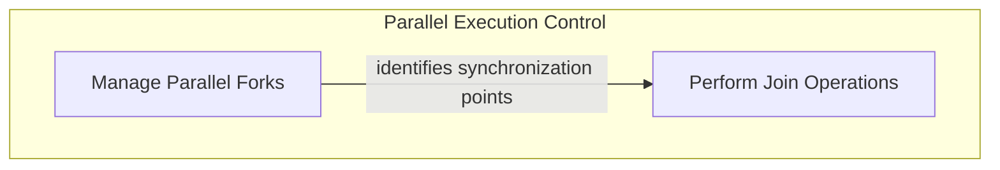

# Parallelism Management

The `parallelism_management` module is a core component within the `pydantic_ai_agent_core.graph_beta_features` that enables the efficient and synchronized execution of parallel processing paths within a graph. It provides mechanisms to define how outputs from divergent execution branches are combined and tools to analyze the graph structure to ensure correct synchronization points. This module is essential for building complex, high-performance graph-based agents that can leverage parallel execution effectively.

## Architecture Overview

This module is structured into two main sub-modules: `fork_management` and `join_operations`. The `fork_management` sub-module is responsible for identifying and validating parent forks, which are critical for establishing proper synchronization points. The `join_operations` sub-module then uses this information to define how to aggregate results from these parallel paths. This separation ensures clear responsibilities and robust handling of complex parallel execution flows, preventing issues like deadlocks and ensuring data consistency.

## Sub-module Functionality

*   **[Fork Management](fork_management.md)**: This sub-module contains the logic for analyzing the graph structure to identify valid "parent forks" for join nodes. It helps prevent deadlocks and ensures that parallel execution paths can be correctly synchronized, providing critical information for managing graph control flow.

*   **[Join Operations](join_operations.md)**: This sub-module defines the `Join` concept, which specifies how to combine outputs from multiple parallel execution paths using a reducer function. It is responsible for the actual aggregation of results after parallel processing, enabling the system to synthesize outcomes from parallel branches.

<!-- DIAGRAM_JSON
{
    "direction": "TD",
    "nodes": [
        {
            "id": "parallelism_management",
            "label": "Parallelism Management",
            "type": "module"
        },
        {
            "id": "fork_management",
            "label": "Manage Parallel Forks",
            "type": "module",
            "link": "fork_management.md"
        },
        {
            "id": "join_operations",
            "label": "Perform Join Operations",
            "type": "module",
            "link": "join_operations.md"
        }
    ],
    "edges": [
        {
            "source": "fork_management",
            "target": "join_operations",
            "label": "identifies synchronization points"
        }
    ],
    "groups": [
        {
            "id": "parallel_control",
            "label": "Parallel Execution Control",
            "role": "generative",
            "nodes": [
                "fork_management",
                "join_operations"
            ]
        }
    ]
}
-->

