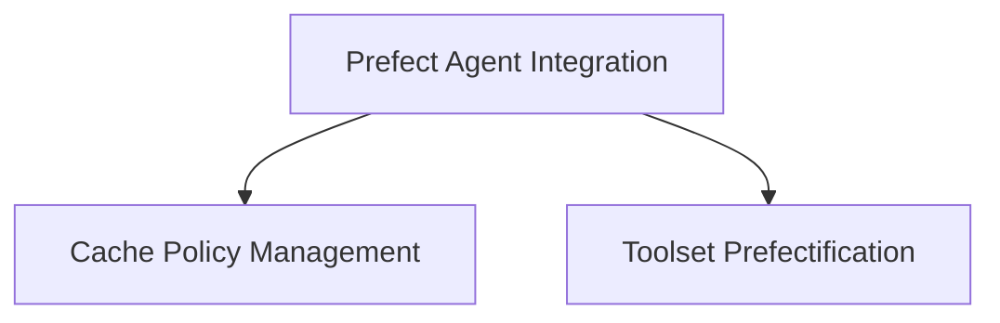

# Prefect Integration Module

## Introduction and Purpose

The `prefect_integration` module facilitates the seamless integration of Pydantic AI agents with Prefect, a workflow management system. It enables agents to leverage Prefect's capabilities for durable execution, allowing long-running agent operations to be managed, retried, and observed within Prefect flows. This module automatically offloads resource-intensive tasks such as model requests, tool calls, and MCP server communication to Prefect tasks, enhancing the reliability and observability of AI agent workflows.

## Architecture Overview

The `prefect_integration` module is designed to wrap existing Pydantic AI agents and their components, transforming them into Prefect-compatible entities. It primarily focuses on three key areas: agent wrapping, cache policy management, and toolset adaptation. The overall architecture is depicted below:

<!-- DIAGRAM_JSON
{
    "direction": "TD",
    "nodes": [
        {"id": "agent_integration", "label": "Prefect Agent Integration", "type": "module", "link": "agent_integration.md"},
        {"id": "cache_management", "label": "Cache Policy Management", "type": "module", "link": "cache_management.md"},
        {"id": "toolset_prefectification", "label": "Toolset Prefectification", "type": "module", "link": "toolset_prefectification.md"}
    ],
    "edges": [
        {"source": "agent_integration", "target": "cache_management"},
        {"source": "agent_integration", "target": "toolset_prefectification"}
    ],
    "groups": []
}
-->

## Sub-modules

Here's a high-level overview of the sub-modules within `prefect_integration`:

### [Agent Integration](agent_integration.md)
This sub-module focuses on the `PrefectAgent` class, which wraps an existing Pydantic AI agent to enable it with Prefect durable flows. It automatically offloads model requests, tool calls, and event stream handling to Prefect tasks, ensuring resilient and observable agent execution.

### [Cache Management](cache_management.md)
This sub-module contains the `PrefectAgentInputs` cache policy, designed to handle input hashing for PrefectAgent cache keys. It intelligently computes cache keys by ignoring transient fields like timestamps and serializing `RunContext` objects to include only hashable data, optimizing caching within Prefect workflows.

### [Toolset Prefectification](toolset_prefectification.md)
This sub-module provides the `prefectify_toolset` function, which adapts Pydantic AI toolsets for execution within Prefect. It wraps methods within `FunctionToolset` and `MCPServer` instances, transforming I/O-intensive operations into Prefect tasks, thereby integrating them seamlessly into Prefect flows.