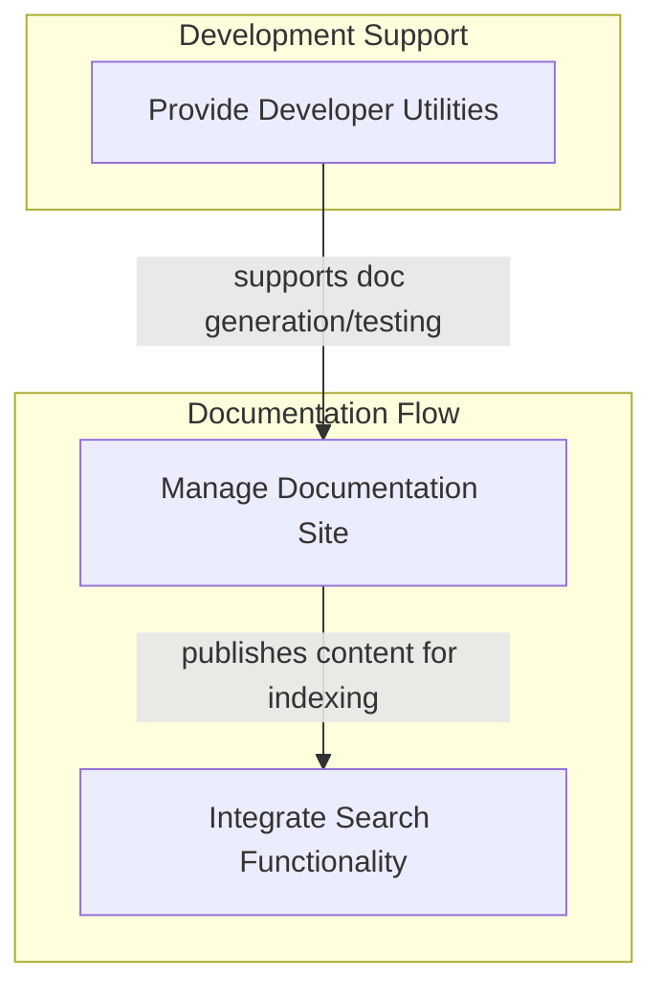

# Project Documentation and Developer Tools

## Introduction and Purpose

The `project_documentation_and_developer_tools` module serves as a central hub for managing and enhancing the project's documentation website, integrating search capabilities, and providing essential developer utility scripts. It ensures that the project's documentation is well-organized, easily searchable, and that development workflows are supported by robust testing and verification tools. This module is critical for maintaining high-quality documentation and streamlining various development and deployment processes.

## Architecture Overview

This module is composed of three main sub-modules: `Documentation Site Management`, `Search and Indexing`, and `Developer Utility Scripts`. These modules interact to provide a comprehensive ecosystem for documentation and developer support.

<!-- DIAGRAM_JSON
{
    "direction": "TD",
    "nodes": [
        {"id": "documentation_site_management", "label": "Manage Documentation Site", "type": "module", "link": "documentation_site_management.md"},
        {"id": "search_and_indexing", "label": "Integrate Search Functionality", "type": "module", "link": "search_and_indexing.md"},
        {"id": "developer_utility_scripts", "label": "Provide Developer Utilities", "type": "module", "link": "developer_utility_scripts.md"}
    ],
    "edges": [
        {"source": "documentation_site_management", "target": "search_and_indexing", "label": "publishes content for indexing"},
        {"source": "developer_utility_scripts", "target": "documentation_site_management", "label": "supports doc generation/testing"}
    ],
    "groups": [
        {
            "id": "documentation_flow",
            "label": "Documentation Flow",
            "role": "surface",
            "nodes": ["documentation_site_management", "search_and_indexing"]
        },
        {
            "id": "development_support",
            "label": "Development Support",
            "role": "analytical",
            "nodes": ["developer_utility_scripts"]
        }
    ]
}
-->

## Sub-modules

### [Documentation Site Management](documentation_site_management.md)
This sub-module focuses on the core aspects of the project's documentation website. It handles content processing, markdown rendering, dynamic content generation (like changelogs), and serving documentation pages. It ensures that the documentation is presented clearly and efficiently to users.

### [Search and Indexing](search_and_indexing.md)
This sub-module is responsible for integrating search capabilities into the documentation site. Specifically, it prepares and processes documentation content for indexing with Algolia, allowing users to quickly find relevant information.

### [Developer Utility Scripts](developer_utility_scripts.md)
This sub-module provides a suite of scripts designed to assist developers with various tasks, including testing, verification of external integrations (like Vertex AI GCS), and managing development artifacts (like VCR cassettes). It contributes to maintaining the project's reliability and developer productivity.
