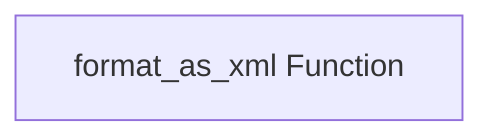

# Prompt Formatting Module

## Introduction

The `prompt_formatting` module provides utilities for converting Python objects into XML format, primarily to facilitate the creation of structured prompts for Large Language Models (LLMs). This module is part of the broader `pydantic_ai_misc` module, focusing on helper functions that enhance how data is presented to AI models.

## Purpose and Core Functionality

The main goal of this module is to offer a flexible and robust way to serialize various Python data types into a standardized XML string. LLMs often perform better when receiving structured input, and XML is a common format that can be easily parsed and understood by these models. The `format_as_xml` function is the cornerstone of this module.

### `format_as_xml` Function

```python
def format_as_xml(
    obj: Any,
    root_tag: str | None = None,
    item_tag: str = 'item',
    none_str: str = 'null',
    indent: str | None = '  ',
    include_field_info: Literal['once'] | bool = False,
) -> str:
```

This function takes a Python object and converts it into an XML string. It supports a wide range of Python types, including primitives, collections (Mappings, Iterables), dataclasses, and Pydantic models. Key features include:

*   **Versatile Type Support**: Handles various Python types for comprehensive serialization.
*   **Customizable Tags**: Allows specification of `root_tag` for the overall XML structure and `item_tag` for elements within iterables.
*   **Null Value Handling**: Defines how `None` values are represented in the XML output.
*   **Pretty Printing**: Supports indentation for human-readable XML.
*   **Field Information Inclusion**: Option to embed Pydantic `Field` attributes or dataclass `field()` metadata (like `title` and `description`) as XML attributes, useful for providing additional context to LLMs.

**Example:**

```python {title="format_as_xml_example.py" lint="skip"}
from pydantic_ai_slim.pydantic_ai.format_prompt import format_as_xml

print(format_as_xml({'name': 'John', 'height': 6, 'weight': 200}, root_tag='user'))
'''
<user>
  <name>John</name>
  <height>6</height>
  <weight>200</weight>
</user>
'''
```

## Architecture and Component Relationships

The `prompt_formatting` module is a leaf module within the `pydantic_ai_misc` package, providing a singular, focused utility. Its core logic is encapsulated within the `format_as_xml` function. Internally, `format_as_xml` leverages a helper class (`_ToXml`, not exposed as a core component) for recursive XML conversion and the standard Python `xml.etree.ElementTree` library for XML element manipulation and serialization.

<!-- DIAGRAM_JSON
{
    "direction": "TD",
    "nodes": [
        {"id": "format_as_xml", "label": "format_as_xml Function", "type": "component", "link": null}
    ],
    "edges": [],
    "groups": []
}
-->


## How the Module Fits into the Overall System

The `prompt_formatting` module plays a crucial role in the `pydantic_ai_slim` ecosystem by providing a standardized method for structuring data before it is sent to LLMs. This functionality is vital for modules that construct prompts, such as those involved in agent execution (`pydantic_ai_agent_core`) or direct model interactions (`pydantic_ai_models`). By enabling clear, machine-readable XML formatting, it helps improve the reliability and interpretability of LLM inputs, ultimately leading to better model responses. It is a foundational utility used by higher-level components that require structured data serialization for AI interactions.
