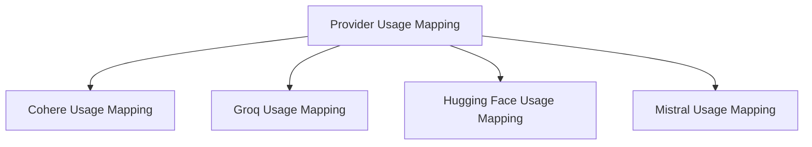

# Provider Usage Mapping Module Documentation

## Introduction

The `provider_usage_mapping` module is a crucial component within the `pydantic_ai_models` system, responsible for standardizing how usage information is extracted and formatted from various AI model providers. This module ensures that usage metrics, such as input and output tokens, are consistently represented across different APIs, facilitating unified reporting and cost analysis.

## Architecture Overview

The `provider_usage_mapping` module acts as an abstraction layer over diverse provider-specific usage reporting mechanisms. It contains dedicated sub-modules, each designed to interpret the unique usage data structures of a particular AI model provider (e.g., Cohere, Groq, Hugging Face, Mistral) and map them to a common `RequestUsage` format. This architecture promotes modularity and simplifies the integration of new providers.

<!-- DIAGRAM_JSON
{
    "direction": "TD",
    "nodes": [
        {"id": "cohere_usage_mapping", "label": "Cohere Usage Mapping", "type": "module", "link": "cohere_usage_mapping.md"},
        {"id": "groq_usage_mapping", "label": "Groq Usage Mapping", "type": "module", "link": "groq_usage_mapping.md"},
        {"id": "huggingface_usage_mapping", "label": "Hugging Face Usage Mapping", "type": "module", "link": "huggingface_usage_mapping.md"},
        {"id": "mistral_usage_mapping", "label": "Mistral Usage Mapping", "type": "module", "link": "mistral_usage_mapping.md"}
    ],
    "edges": [
        {"source": "provider_usage_mapping", "target": "cohere_usage_mapping"},
        {"source": "provider_usage_mapping", "target": "groq_usage_mapping"},
        {"source": "provider_usage_mapping", "target": "huggingface_usage_mapping"},
        {"source": "provider_usage_mapping", "target": "mistral_usage_mapping"}
    ],
    "groups": []
}
-->

## Sub-modules

This module comprises the following sub-modules, each handling usage mapping for a specific AI provider:

*   ### [Cohere Usage Mapping](cohere_usage_mapping.md)
    Responsible for parsing Cohere API responses and extracting relevant usage metrics, converting them into a standardized format.

*   ### [Groq Usage Mapping](groq_usage_mapping.md)
    Handles the extraction and mapping of usage data from Groq API chat completion chunks and responses.

*   ### [Hugging Face Usage Mapping](huggingface_usage_mapping.md)
    Provides the logic to interpret and standardize usage information received from Hugging Face API chat completion outputs.

*   ### [Mistral Usage Mapping](mistral_usage_mapping.md)
    Focuses on mapping usage details from Mistral API chat completion responses and chunks to the common `RequestUsage` object.