The `pydantic_ai_agent_core` module provides the foundational framework for building, configuring, executing, and managing intelligent AI agents. It empowers users to define complex agent behaviors, integrate with diverse language models (LLMs) and embedding services, incorporate various tools, enable durable execution, and connect to interactive user interfaces. At its heart, it leverages a robust graph-based execution engine to orchestrate workflows with Pydantic-driven validation and structured data handling.

### How Components Work Together

The module's components collaborate to bring AI agents to life, from their initial definition to their dynamic execution and interaction with external services. Agent structures and capabilities are defined, forming a blueprint that guides their behavior. These agents then interact with various AI services (LLMs, embedding models) and a rich ecosystem of built-in and external tools. The core runtime orchestrates these interactions within a graph-based workflow, processing inputs, executing steps, and handling outputs. Advanced features like durable execution, UI integration, and the Model Context Protocol (MCP) extend the agent's reach and resilience.

```mermaid
flowchart TD
    subgraph agent_definition_config["Agent Definition & Configuration"]
        A[Define Agent Structure]
        B[Configure Agent Capabilities]
        C[Manage Agent Tools]
    end

    subgraph ai_service_interaction["AI Service Integration"]
        D[Interact with LLMs]
        E[Generate Embeddings]
        F[Access Built-in Tools]
        G[Integrate External Tools]
    end

    subgraph agent_runtime_orchestration["Agent Runtime & Orchestration"]
        H[Orchestrate Agent Flow]
        I[Process Agent Output]
        J[Provide Core Utilities]
        K[Execute Graph Workflows]
    end

    subgraph advanced_integrations["Advanced Integrations"]
        L[Enable Durable Execution]
        M[Integrate UI Frontends]
        N[Manage MCP Interactions]
    end

    %% Core flow
    A ==>|"agent spec"| B
    B -->|"configured capabilities"| C
    C -->|"available tools"| H
    D -->|"model responses"| H
    E -->|"embedding vectors"| F
    F -->|"tool results"| H
    G -->|"tool results"| H

    H ==>|"execution steps"| I
    H -->|"uses utilities"| J
    K -->|"powers agent logic"| H

    %% Cross-cutting concerns
    L -.->|"wraps agent execution"| H
    M -.->|"receives UI events"| I
    N -.->|"provides models/tools"| D
    N -.->|"provides models/tools"| C

    classDef surface fill:#dbeafe,stroke:#3b82f6,stroke-width:2px,color:#1e3a5f
    classDef data fill:#d1fae5,stroke:#10b981,stroke-width:2px,color:#065f46
    classDef generative fill:#fed7aa,stroke:#ea580c,stroke-width:1px,color:#7c2d12
    classDef analytical fill:#ede9fe,stroke:#8b5cf6,stroke-width:1px,color:#4c1d95

    class A,B,C generative
    class D,E,F,G data
    class H,I,J,K analytical
    class L,M,N surface

    click A "pydantic_ai_slim.pydantic_ai.agent.spec.AgentSpec.md" "View AgentSpec Documentation"
    click B "pydantic_ai_slim.pydantic_ai.capabilities.abstract.AbstractCapability.md" "View AbstractCapability Documentation"
    click C "pydantic_ai_slim.pydantic_ai._tool_manager.ToolManager.md" "View ToolManager Documentation"
    click D "pydantic_ai_slim.pydantic_ai.models.__init__.Model.md" "View Model Documentation"
    click E "pydantic_ai_slim.pydantic_ai.embeddings.__init__.Embedder.md" "View Embedder Documentation"
    click F "pydantic_ai_slim.pydantic_ai.builtin_tools.CodeExecutionTool.md" "View CodeExecutionTool Documentation"
    click G "pydantic_ai_slim.pydantic_ai.toolsets.external.DeferredToolset.md" "View DeferredToolset Documentation"
    click H "pydantic_ai_slim.pydantic_ai._agent_graph.ModelRequestNode.md" "View ModelRequestNode Documentation"
    click I "pydantic_ai_slim.pydantic_ai.result.AgentStream.md" "View AgentStream Documentation"
    click J "pydantic_ai_slim.pydantic_ai._utils.run_in_executor.md" "View run_in_executor Documentation"
    click K "pydantic_graph.pydantic_graph.graph.Graph.md" "View Graph Documentation"
    click L "pydantic_ai_slim.pydantic_ai.durable_exec.temporal._agent.TemporalAgent.md" "View TemporalAgent Documentation"
    click M "pydantic_ai_slim.pydantic_ai.ui.vercel_ai._adapter.VercelAIAdapter.md" "View VercelAIAdapter Documentation"
    click N "pydantic_ai_slim.pydantic_ai.mcp.MCPServerHTTP.md" "View MCPServerHTTP Documentation"
```

### Core Components Documentation

*   **Define Agent Structure**: [`pydantic_ai_slim.pydantic_ai.agent.spec.AgentSpec`](pydantic_ai_slim.pydantic_ai.agent.spec.AgentSpec.md)
*   **Configure Agent Capabilities**: [`pydantic_ai_slim.pydantic_ai.capabilities.abstract.AbstractCapability`](pydantic_ai_slim.pydantic_ai.capabilities.abstract.AbstractCapability.md)
*   **Manage Agent Tools**: [`pydantic_ai_slim.pydantic_ai._tool_manager.ToolManager`](pydantic_ai_slim.pydantic_ai._tool_manager.ToolManager.md)
*   **Interact with LLMs**: [`pydantic_ai_slim.pydantic_ai.models.__init__.Model`](pydantic_ai_slim.pydantic_ai.models.__init__.Model.md)
*   **Generate Embeddings**: [`pydantic_ai_slim.pydantic_ai.embeddings.__init__.Embedder`](pydantic_ai_slim.pydantic_ai.embeddings.__init__.Embedder.md)
*   **Access Built-in Tools**: [`pydantic_ai_slim.pydantic_ai.builtin_tools.CodeExecutionTool`](pydantic_ai_slim.pydantic_ai.builtin_tools.CodeExecutionTool.md)
*   **Integrate External Tools**: [`pydantic_ai_slim.pydantic_ai.toolsets.external.DeferredToolset`](pydantic_ai_slim.pydantic_ai.toolsets.external.DeferredToolset.md)
*   **Orchestrate Agent Flow**: [`pydantic_ai_slim.pydantic_ai._agent_graph.ModelRequestNode`](pydantic_ai_slim.pydantic_ai._agent_graph.ModelRequestNode.md)
*   **Process Agent Output**: [`pydantic_ai_slim.pydantic_ai.result.AgentStream`](pydantic_ai_slim.pydantic_ai.result.AgentStream.md)
*   **Provide Core Utilities**: [`pydantic_ai_slim.pydantic_ai._utils.run_in_executor`](pydantic_ai_slim.pydantic_ai._utils.run_in_executor.md)
*   **Execute Graph Workflows**: [`pydantic_graph.pydantic_graph.graph.Graph`](pydantic_graph.pydantic_graph.graph.Graph.md)
*   **Enable Durable Execution**: [`pydantic_ai_slim.pydantic_ai.durable_exec.temporal._agent.TemporalAgent`](pydantic_ai_slim.pydantic_ai.durable_exec.temporal._agent.TemporalAgent.md)
*   **Integrate UI Frontends**: [`pydantic_ai_slim.pydantic_ai.ui.vercel_ai._adapter.VercelAIAdapter`](pydantic_ai_slim.pydantic_ai.ui.vercel_ai._adapter.VercelAIAdapter.md)
*   **Manage MCP Interactions**: [`pydantic_ai_slim.pydantic_ai.mcp.MCPServerHTTP`](pydantic_ai_slim.pydantic_ai.mcp.MCPServerHTTP.md)