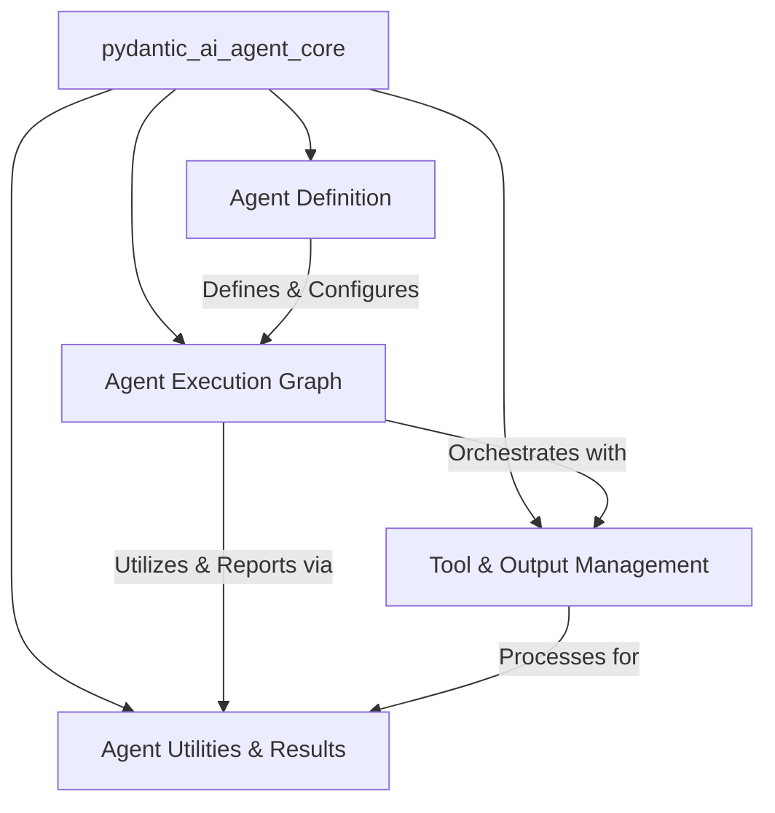

The `pydantic_ai_agent_core` module serves as the foundational framework for building and managing AI agents within the `pydantic-ai` ecosystem. It orchestrates the agent's execution flow, defines its core structure and capabilities, manages tool interactions and output processing, and provides essential utilities for handling results and asynchronous operations. This module ensures a consistent, extensible, and robust environment for developing diverse AI agent applications.

### Architecture Overview

The `pydantic_ai_agent_core` module is composed of several key sub-modules that work in concert to define, execute, and manage AI agents. The `Agent Definition` module establishes the agent's blueprint, which is then brought to life by the `Agent Execution Graph`. During execution, the `Tool & Output Management` module handles interactions with external tools and processes agent outputs, while `Agent Utilities & Results` provides essential support functions and manages the final results.

### Core Components Documentation

The `pydantic_ai_agent_core` module is structured around the following core sub-modules:

*   **[Agent Definition](agent_definition.md)**
    This module is a foundational component responsible for establishing the core structure, configuration, and capabilities of AI agents. It provides the abstract base for all agent implementations, manages their specifications, and facilitates the dynamic instantiation and validation of their functionalities.

*   **[Agent Execution Graph](agent_execution_graph.md)**
    This module is central to orchestrating the execution flow of an AI agent. It defines the core nodes and mechanisms for processing user prompts, making model requests, handling tool calls, and managing the agent's message history and state.

*   **[Tool & Output Management](tool_output_management.md)**
    This module is responsible for orchestrating the execution of tools, defining and validating agent outputs, and managing the streaming of model responses within the `pydantic_ai_slim` framework. It provides core functionalities for agents to interact with tools, process their results, and structure their final responses.

*   **[Agent Utilities & Results](agent_utilities_results.md)**
    This module provides essential utilities and mechanisms for handling agent execution results, including asynchronous operations, stream processing, and usage tracking. It acts as a foundational layer for managing the lifecycle and output of agent interactions.