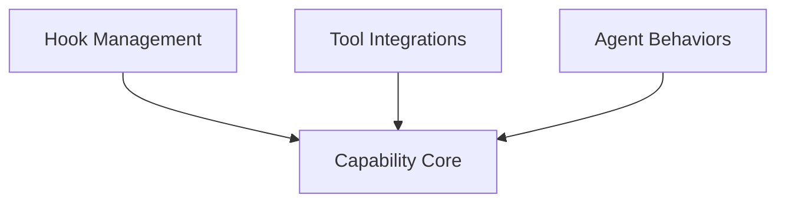

# pydantic_ai_capabilities Module Documentation

## Introduction

The `pydantic_ai_capabilities` module provides a flexible and extensible system for defining and managing agent behaviors and functionalities within the Pydantic AI framework. Capabilities are reusable, composable units that encapsulate instructions, model settings, tools, and hooks, allowing developers to customize agent behavior across various lifecycle stages.

## Architecture Overview

The module is structured around an abstract `AbstractCapability` base class, which defines the core interface for all capabilities. Concrete capabilities extend this base, providing specific functionalities such as tool integration, hook management, and behavioral modifications. The design emphasizes modularity, allowing capabilities to be easily combined and configured to build sophisticated AI agents.

<!-- DIAGRAM_JSON
{
    "direction": "TD",
    "nodes": [
        {"id": "capability_core", "label": "Capability Core", "type": "module", "link": "capability_core.md"},
        {"id": "hook_management", "label": "Hook Management", "type": "module", "link": "hook_management.md"},
        {"id": "tool_integrations", "label": "Tool Integrations", "type": "module", "link": "tool_integrations.md"},
        {"id": "agent_behaviors", "label": "Agent Behaviors", "type": "module", "link": "agent_behaviors.md"}
    ],
    "edges": [
        {"source": "hook_management", "target": "capability_core"},
        {"source": "tool_integrations", "target": "capability_core"},
        {"source": "agent_behaviors", "target": "capability_core"}
    ],
    "groups": []
}
-->

## Sub-modules

### [Capability Core](capability_core.md)
This sub-module defines the fundamental interface and lifecycle hooks for all agent capabilities. It provides the `AbstractCapability` class, which serves as the base for all other capabilities, enabling a consistent structure for extending agent functionalities.

### [Hook Management](hook_management.md)
This sub-module provides mechanisms for registering and managing custom lifecycle hooks within the agent's execution flow. It includes the `Hooks` capability for flexible hook registration via decorators or constructor arguments, allowing developers to inject custom logic at various stages of an agent run.

### [Tool Integrations](tool_integrations.md)
This sub-module manages the integration of various tools, including built-in provider tools, local fallbacks, and specific web-oriented capabilities. It features capabilities like `BuiltinOrLocalTool` for flexible tool provision, `MCP` for server interactions, `WebFetch` for URL fetching, and `WebSearch` for web search functionalities.

### [Agent Behaviors](agent_behaviors.md)
This sub-module offers capabilities to modify core agent behaviors, such as history processing, model reasoning, and execution threading. It includes `HistoryProcessor` for pre-model request message manipulation, `Thinking` for configuring model reasoning levels, and `ThreadExecutor` for managing synchronous function execution.
