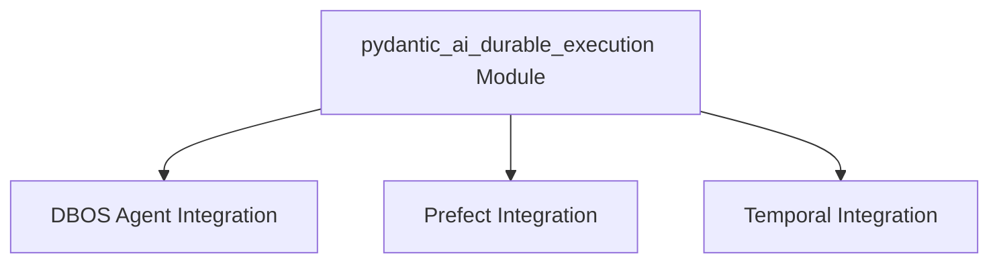

## `pydantic_ai_durable_execution` Module Overview

### Purpose of the Module

The `pydantic_ai_durable_execution` module is designed to enhance the reliability, fault-tolerance, and observability of Pydantic AI agents by integrating them with various durable execution frameworks. It provides mechanisms to persist agent state, recover from failures, and manage long-running operations by offloading critical agent actions, such as model requests and tool calls, to robust workflow orchestration systems like DBOS, Prefect, and Temporal. This enables developers to build AI applications that are resilient in distributed and potentially unreliable environments.

### Architecture of the Module

The `pydantic_ai_durable_execution` module acts as an integration layer, offering distinct sub-modules for each supported durable execution framework. Each sub-module provides a specialized agent wrapper and utility functions to adapt Pydantic AI's core components (agents, models, toolsets) for durable execution within its respective framework.

### References to Core Components Documentation

The module is composed of three primary integration sub-modules, each focusing on a specific durable execution framework:

#### 1. DBOS Agent Integration

This sub-module provides the `DBOSAgent` for integrating Pydantic AI agents with the Distributed Business Operating System (DBOS) framework. It wraps existing agents to make model requests and tool calls durable DBOS steps.

*   **Core Component**:
    *   [`DBOSAgent`](dbos_agent.md#dbosagent-class): Wraps an `AbstractAgent` to enable durable execution via DBOS workflows.
*   **Key Interactions**:
    *   [`AbstractAgent`](pydantic_ai_agent_core.md#abstractagent-class): The base agent class being wrapped.
    *   [`Model`](pydantic_ai_models.md#model-class): Replaced with a `DBOSModel` for durable model interactions.
    *   [`AbstractToolset`](pydantic_ai_tools.md#abstracttoolset-class): Transformed into DBOS-aware toolsets.
    *   DBOS Framework: The external system providing durable execution.

#### 2. Prefect Integration

This sub-module facilitates the integration of Pydantic AI agents with Prefect, a workflow management system, enabling durable and observable agent execution.

*   **Core Components**:
    *   [`PrefectAgent`](prefect_integration.md#agent_integration): Wraps an `AbstractAgent` to offload model requests and tool calls to Prefect tasks.
    *   [`PrefectAgentInputs`](prefect_integration.md#cache_management): Defines cache policies for PrefectAgent inputs.
    *   [`prefectify_toolset`](prefect_integration.md#toolset_prefectification): Adapts Pydantic AI toolsets for Prefect execution.
*   **Key Interactions**:
    *   [`AbstractAgent`](pydantic_ai_agent_core.md#abstractagent-class): The base agent class integrated with Prefect.
    *   Prefect: The external workflow management system.

#### 3. Temporal Integration

This sub-module provides the `TemporalAgent` for integrating Pydantic AI agents with Temporal.io workflows, ensuring durable and reliable AI agent execution in distributed systems.

*   **Core Components**:
    *   [`TemporalAgent`](temporal_agent.md#temporalagent): The central class wrapping an `AbstractAgent` for Temporal workflow compatibility.
    *   [`TemporalRunContext`](temporal_agent.md#temporalruncontext): A specialized `RunContext` for state serialization across Temporal activities.
    *   [`temporalize_toolset`](temporal_agent.md#temporalize_toolset): A utility function to adapt toolsets for Temporal activities.
    *   [`TemporalWrapperToolset`](temporal_agent.md#temporalwrappertoolset): Wraps `AbstractToolset` for Temporal activity execution.
    *   `TemporalMCPToolset`: A Temporal-compatible Multi-Cloud Platform toolset.
*   **Key Interactions**:
    *   [`AbstractAgent`](agent_abstract_base.md): The base agent class wrapped by `TemporalAgent`.
    *   [`AbstractToolset`](tool_output_management.md): Adapted for Temporal activities.
    *   [`Models Module`](base_model_abstractions.md): Interacted with via `TemporalModel` for durable model requests.
    *   [`TemporalProviderFactory`](pydantic_ai_providers.md): Used for dynamic model instantiation within Temporal workflows.
    *   Temporal SDK: The underlying Temporal Python SDK for workflow and activity definition.