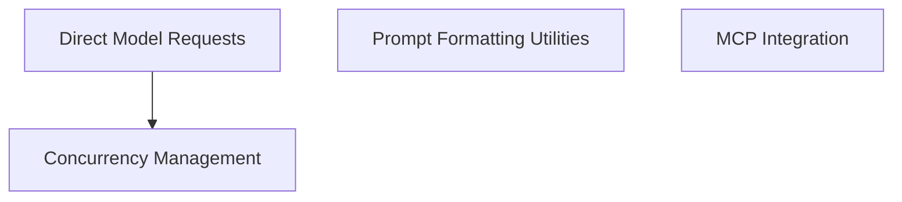

# pydantic_ai_misc Module Documentation

## Introduction

The `pydantic_ai_misc` module contains a collection of miscellaneous utilities and helper components that support various functionalities within the larger pydantic-ai ecosystem. These components range from concurrency management and direct model interaction to prompt formatting and Model Context Protocol (MCP) integration. This module aims to provide essential, reusable tools that enhance the overall system's capabilities and performance.

## Architecture Overview

The `pydantic_ai_misc` module is structured into several sub-modules, each addressing a specific area of functionality. These sub-modules are designed to be relatively independent but work cohesively to provide core utilities. The overall architecture emphasizes clear separation of concerns, allowing for easier maintenance and extension.

<!-- DIAGRAM_JSON
{
    "direction": "TD",
    "nodes": [
        {"id": "concurrency_management", "label": "Concurrency Management", "type": "module", "link": "concurrency_management.md"},
        {"id": "direct_model_requests", "label": "Direct Model Requests", "type": "module", "link": "direct_model_requests.md"},
        {"id": "prompt_formatting", "label": "Prompt Formatting Utilities", "type": "module", "link": "prompt_formatting.md"},
        {"id": "mcp_integration", "label": "MCP Integration", "type": "module", "link": "mcp_integration.md"}
    ],
    "edges": [
        {"source": "direct_model_requests", "target": "concurrency_management"}
    ],
    "groups": []
}
-->

## Sub-modules

### [Concurrency Management](concurrency_management.md)
This sub-module is responsible for managing and limiting concurrent operations within the system. It uses `ConcurrencyLimiter` to track waiting tasks and provide observability into resource contention.

### [Direct Model Requests](direct_model_requests.md)
This sub-module offers synchronous interfaces for making direct, non-streamed and streamed requests to various AI models. It provides convenience functions for easy interaction with language models.

### [Prompt Formatting Utilities](prompt_formatting.md)
This sub-module provides utilities for formatting Python objects into structured formats like XML, which can be particularly useful for optimizing prompt readability and parsing by Large Language Models (LLMs).

### [MCP Integration](mcp_integration.md)
This sub-module handles the integration with the Model Context Protocol (MCP). It includes components for MCP server communication, loading server configurations, and managing resources and resource templates as defined by the MCP specification.
