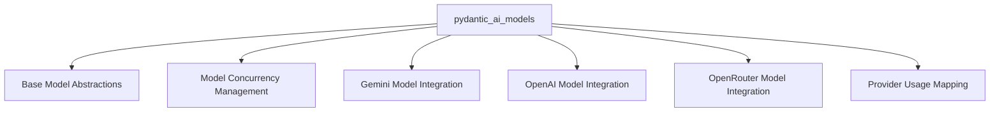

The `pydantic_ai_models` module serves as the central hub for defining, managing, and interacting with various AI language models within the `pydantic-ai` ecosystem. It provides a unified and extensible framework that abstracts away the complexities of different model APIs, offering core interfaces for models and streamed responses. This module facilitates seamless integration with popular AI providers (e.g., OpenAI, Gemini, OpenRouter), implements crucial features like model concurrency control and fallback mechanisms, and standardizes the tracking of usage metrics across diverse APIs.

## Architecture

The `pydantic_ai_models` module is structured into several key sub-modules, each responsible for a specific aspect of model management and interaction. This modular design enhances maintainability, allows for easy extension with new models or providers, and separates concerns such as core abstractions, provider-specific implementations, and utility functions.

## Core Components Documentation

The module is composed of the following key sub-modules:

*   ### [Base Model Abstractions](base_model_abstractions.md)
    Defines the fundamental `Model` and `StreamedResponse` interfaces, along with generic model wrappers and specialized models like `FallbackModel`, `FunctionModel`, `MCPSamplingModel`, and `OutlinesModel`.

*   ### [Model Concurrency Management](model_concurrency.md)
    Provides utilities, such as `limit_model_concurrency`, to control and limit the number of concurrent requests to AI models, ensuring stable operation and adherence to API rate limits.

*   ### [Gemini Model Integration](gemini_model_integration.md)
    Contains the specific implementation for interacting with Google Gemini models, including `GeminiModel`, `GeminiStreamedResponse`, and internal utilities for response processing and usage mapping.

*   ### [OpenAI Model Integration](openai_model_integration.md)
    Handles the integration with OpenAI models, featuring `OpenAIModel`, `OpenAIStreamedResponse`, and settings for configuring OpenAI API requests and mapping responses.

*   ### [OpenRouter Model Integration](openrouter_model_integration.md)
    Facilitates interaction with OpenRouter models, providing `OpenRouterStreamedResponse` and data models for parsing OpenRouter's specific API response formats.

*   ### [Provider Usage Mapping](provider_usage_mapping.md)
    Offers standardized functions (e.g., `_map_usage` for Cohere, Groq, Hugging Face, Mistral) to extract and format usage statistics from various AI model providers into a consistent `RequestUsage` object.