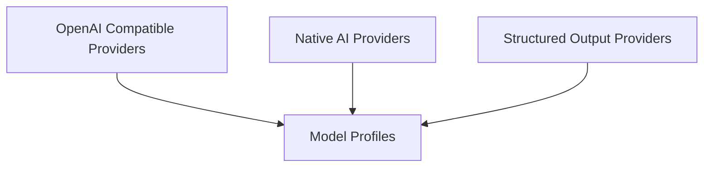

# pydantic_ai_providers Module Documentation

## Introduction and Purpose

The `pydantic_ai_providers` module serves as the central hub for integrating with a diverse ecosystem of AI model providers. Its primary purpose is to abstract away the complexities of interacting with different AI APIs, offering a unified and consistent interface for developers within the Pydantic-AI framework. This module enables seamless switching between various AI models and services by encapsulating provider-specific authentication, API endpoints, model profiles, and client configurations.

## Architecture Overview

The `pydantic_ai_providers` module is structured into several key sub-modules, each responsible for a specific aspect of provider integration. This modular design enhances maintainability, allows for easy addition of new providers, and clearly separates concerns.

<!-- DIAGRAM_JSON
{
    "direction": "TD",
    "nodes": [
        {"id": "model_profiles", "label": "Model Profiles", "type": "module", "link": "model_profiles.md"},
        {"id": "native_providers", "label": "Native AI Providers", "type": "module", "link": "native_providers.md"},
        {"id": "openai_compatible_providers", "label": "OpenAI Compatible Providers", "type": "module", "link": "openai_compatible_providers.md"},
        {"id": "structured_output_providers", "label": "Structured Output Providers", "type": "module", "link": "structured_output_providers.md"}
    ],
    "edges": [
        {"source": "openai_compatible_providers", "target": "model_profiles"},
        {"source": "native_providers", "target": "model_profiles"},
        {"source": "structured_output_providers", "target": "model_profiles"}
    ],
    "groups": []
}
-->

## High-Level Functionality of Each Sub-module

### [Model Profiles](model_profiles.md)
This sub-module is responsible for defining and retrieving specific configurations and capabilities for various AI models across different providers. It includes functions like `groq_model_profile` and `harmony_model_profile`, which detail model-specific features such as reasoning capabilities, tool support, and output formats.

### [Native AI Providers](native_providers.md)
This section covers integrations with AI service providers that utilize their native SDKs or unique API interfaces. It includes providers like `CohereProvider`, `MistralProvider`, `HuggingFaceProvider`, `VoyageAIProvider`, and `XaiProvider`, each offering direct, optimized access to their respective AI models.

### [OpenAI Compatible Providers](openai_compatible_providers.md)
This sub-module focuses on AI service providers that offer an OpenAI-compatible API. It simplifies integration with a wide range of providers such as `AlibabaProvider`, `AzureProvider`, `CerebrasProvider`, `DeepSeekProvider`, `FireworksProvider`, `GitHubProvider`, `GrokProvider`, `HerokuProvider`, `LiteLLMProvider`, `MoonshotAIProvider`, `NebiusProvider`, `OllamaProvider`, `OVHcloudProvider`, `SambaNovaProvider`, `TogetherProvider`, and `VercelProvider`, by leveraging the familiar OpenAI API structure.

### [Structured Output Providers](structured_output_providers.md)
This sub-module is dedicated to specialized providers like `OutlinesProvider` that are optimized for generating structured outputs (e.g., JSON Schema, JSON Object). It highlights models and configurations that excel in ensuring output adherence to predefined schemas, crucial for reliable programmatic interaction with AI responses.
