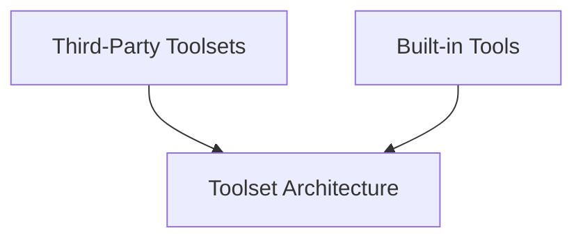

# pydantic_ai_tools Module Documentation

## Introduction

The `pydantic_ai_tools` module provides a comprehensive collection of tools and toolsets designed to extend the capabilities of AI agents. These tools range from fundamental built-in functionalities to integrations with various third-party services and frameworks, enabling agents to interact with the external world, execute code, manage memory, and search through information effectively.

## Architecture Overview

The `pydantic_ai_tools` module is organized into several key sub-modules, each addressing a specific aspect of tool provision and management. This structure ensures a modular and extensible system, allowing for easy integration of new tools and maintenance of existing ones. The main components include built-in utilities, wrappers for third-party services, and the foundational architecture for creating and managing toolsets.

<!-- DIAGRAM_JSON
{
    "direction": "TD",
    "nodes": [
        {"id": "builtin_tools", "label": "Built-in Tools", "type": "module", "link": "builtin_tools.md"},
        {"id": "third_party_toolsets", "label": "Third-Party Toolsets", "type": "module", "link": "third_party_toolsets.md"},
        {"id": "toolset_architecture", "label": "Toolset Architecture", "type": "module", "link": "toolset_architecture.md"}
    ],
    "edges": [
        {"source": "third_party_toolsets", "target": "toolset_architecture"},
        {"source": "builtin_tools", "target": "toolset_architecture"}
    ],
    "groups": []
}
-->

## Sub-modules

### [Built-in Tools](builtin_tools.md)

This sub-module encapsulates the core tools directly integrated into the system. It provides essential functionalities such as `UrlContextTool` for handling URL contexts, `CodeExecutionTool` for executing code, `MemoryTool` for agent memory management, and `FileSearchTool` for vector-based file search (RAG).

### [Third-Party Toolsets](third_party_toolsets.md)

This section details toolsets that integrate with external services and frameworks. It includes `ExaToolset` for Exa search, `tavily_search_tool` for Tavily search capabilities, `ACIToolset` for wrapping ACI.dev tools, and `LangChainToolset` for integrating LangChain tools, enabling agents to leverage a wide array of external resources.

### [Toolset Architecture](toolset_architecture.md)

This sub-module lays the foundational framework for all toolsets within the system. It defines the `AbstractToolset` base class, which outlines the interface for all toolsets, and includes specialized implementations like `DeferredToolset` for managing tool loading and `FastMCPToolset` for interacting with FastMCP Servers, ensuring robust and flexible tool management.