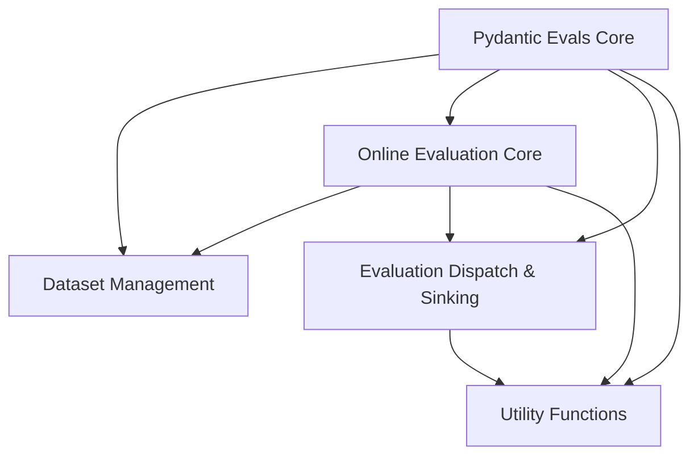

# pydantic_evals_core Module Documentation

## Introduction and Purpose

The `pydantic_evals_core` module provides the foundational components for defining, generating, and running evaluations within the Pydantic Evals framework. It enables the creation of structured datasets, the generation of test cases using Large Language Models (LLMs), and the seamless integration of online evaluation mechanisms into applications. This module is central to setting up and managing the evaluation lifecycle for AI agents and models.

## Architecture Overview

The `pydantic_evals_core` module is structured into several key sub-modules, each responsible for a specific aspect of the evaluation process:

*   **Dataset Management**: Handles the creation and management of evaluation datasets.
*   **Online Evaluation Core**: Manages the core logic and configuration for real-time evaluations.
*   **Evaluation Dispatch & Sinking**: Orchestrates the execution and reporting of individual evaluations.
*   **Utility Functions**: Provides common helper functions used across the module.

The diagram below illustrates the relationships and dependencies between these sub-modules.

<!-- DIAGRAM_JSON
{
    "direction": "TD",
    "nodes": [
        {"id": "pydantic_evals_core", "label": "Pydantic Evals Core", "type": "module"},
        {"id": "dataset_management", "label": "Dataset Management", "type": "module", "link": "dataset_management.md"},
        {"id": "online_evaluation_core", "label": "Online Evaluation Core", "type": "module", "link": "online_evaluation_core.md"},
        {"id": "evaluation_dispatch_and_sinking", "label": "Evaluation Dispatch & Sinking", "type": "module", "link": "evaluation_dispatch_and_sinking.md"},
        {"id": "utility_functions", "label": "Utility Functions", "type": "module", "link": "utility_functions.md"}
    ],
    "edges": [
        {"source": "pydantic_evals_core", "target": "dataset_management"},
        {"source": "pydantic_evals_core", "target": "online_evaluation_core"},
        {"source": "pydantic_evals_core", "target": "evaluation_dispatch_and_sinking"},
        {"source": "pydantic_evals_core", "target": "utility_functions"},
        {"source": "online_evaluation_core", "target": "dataset_management"},
        {"source": "online_evaluation_core", "target": "evaluation_dispatch_and_sinking"},
        {"source": "online_evaluation_core", "target": "utility_functions"},
        {"source": "evaluation_dispatch_and_sinking", "target": "utility_functions"}
    ],
    "groups": []
}
-->

## Sub-modules

### [Dataset Management](dataset_management.md)
This sub-module focuses on the definition and generation of structured evaluation datasets. It includes the `Dataset` Pydantic model for defining evaluation cases and the `generate_dataset` function for populating these datasets using LLMs.

### [Online Evaluation Core](online_evaluation_core.md)
This sub-module contains the central logic for conducting online evaluations. It provides the `OnlineEvalConfig` for global evaluation settings, the `wrapper` for instrumenting functions with evaluation capabilities, and internal mechanisms like `_run_once` and `_run` for executing tasks within an evaluation context.

### [Evaluation Dispatch & Sinking](evaluation_dispatch_and_sinking.md)
Responsible for the asynchronous handling of individual evaluators and the submission of their results. Key components include `_dispatch_single_evaluator` which manages the execution of a single evaluator, and `_submit_to_sink` for sending evaluation outcomes to designated reporting destinations.

### [Utility Functions](utility_functions.md)
This sub-module aggregates general-purpose helper functions that support various operations across the `pydantic_evals_core` module, such as `get_event_loop` for managing asynchronous event loops.
