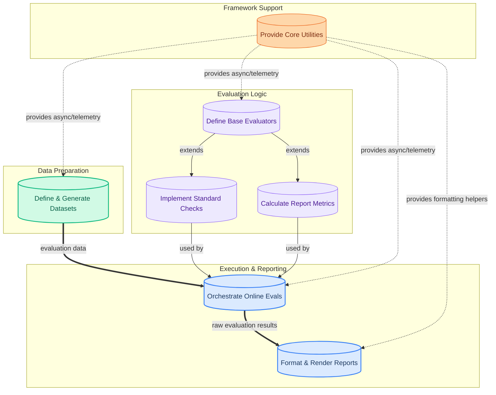

The `pydantic_evals_framework` module provides a comprehensive and flexible framework for evaluating AI models and systems. Its purpose is to enable users to define structured datasets, implement various evaluation metrics (from simple content checks to complex statistical analyses and LLM-based judgments), and orchestrate both offline and real-time online evaluations. The framework also includes robust reporting tools to visualize and interpret evaluation results, ensuring continuous monitoring and improvement of AI performance.

### How the Module's Components Work Together

The `pydantic_evals_framework` is structured into several key modules that collaborate to deliver a complete evaluation pipeline:

*   **Data Preparation**: Users define and generate evaluation datasets, which serve as the input for the evaluation process.
*   **Evaluation Logic**: Core evaluators are defined, and specific implementations for standard checks (e.g., content, type) and advanced statistical metrics are provided.
*   **Execution & Reporting**: The system orchestrates the execution of evaluations, either offline or in real-time, and then processes and renders the results into human-readable reports.
*   **Framework Support**: Underlying utilities provide essential services like asynchronous task management and observability, supporting all other components.

### Core Components Documentation

The `pydantic_evals_framework` module is composed of the following key sub-modules:

*   **[Dataset Management](dataset_management.md)**: Responsible for defining, generating, and managing datasets used in evaluating AI models. It provides structured ways to represent test cases and integrate evaluators.
*   **[Evaluator Core](evaluator_core.md)**: The foundational component providing essential interfaces and base classes for defining and executing various types of evaluations. It establishes the common structure for all evaluators.
*   **[Standard Evaluators](standard_evaluators.md)**: A collection of commonly used evaluators for assessing outputs, including LLM-based judgments and direct data content/type checks.
*   **[Metric Evaluators](metric_evaluators.md)**: Provides a robust set of tools for performing experiment-wide statistical analysis and reporting on evaluation results, focusing on aggregated metrics.
*   **[Online Evaluation System](online_evaluation_system.md)**: Offers a robust framework for attaching evaluators to functions, enabling real-time, online evaluation of their inputs and outputs.
*   **[Reporting and Rendering](reporting_and_rendering.md)**: Responsible for formatting and presenting numerical and duration data in a clear and consistent manner for evaluation reports.
*   **[Framework Utilities](framework_utilities.md)**: A foundational collection of helper functions and tools that support various essential aspects of the framework, such as asynchronous operations and observability.