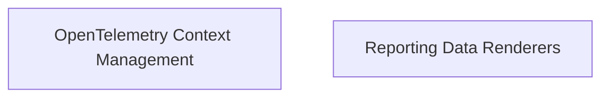

# Pydantic Evals Reporting Module

## Introduction

The `pydantic_evals_reporting` module is a crucial component of the `pydantic_evals` ecosystem, focusing on the presentation and interpretation of evaluation results. It provides functionalities for rendering numerical differences, duration differences, and managing OpenTelemetry span contexts for robust observability.

This module aims to transform raw evaluation data into human-readable and actionable insights, facilitating better understanding of model performance and system behavior over time.

## Architecture Overview

The `pydantic_evals_reporting` module is structured into several sub-modules, each responsible for a specific aspect of reporting and observability. The primary sub-modules include:

*   **OpenTelemetry Context Management**: Handles the creation and management of OpenTelemetry span trees for detailed tracing.
*   **Reporting Data Renderers**: Provides utilities for formatting and displaying numerical and duration-based metrics, highlighting changes and trends.

These sub-modules work in conjunction to ensure that evaluation results are not only accurate but also clearly presented, aiding in debugging, performance analysis, and decision-making.

<!-- DIAGRAM_JSON
{
    "direction": "TD",
    "nodes": [
        {"id": "otel_context_management", "label": "OpenTelemetry Context Management", "type": "module", "link": "otel_context_management.md"},
        {"id": "reporting_renderers", "label": "Reporting Data Renderers", "type": "module", "link": "reporting_renderers.md"}
    ],
    "edges": [],
    "groups": []
}
-->

## Sub-modules

### [OpenTelemetry Context Management](otel_context_management.md)

This sub-module is responsible for providing utilities for managing OpenTelemetry spans within a context, enabling structured tracing and error handling. It allows for the collection of all spans during a specific context, which can then be analyzed to understand the flow and performance of operations.

### [Reporting Data Renderers](reporting_renderers.md)

The `reporting_renderers` sub-module contains functions for formatting and rendering numerical and duration differences for reporting purposes. It includes logic for calculating and displaying absolute and relative changes for various metrics, making it easier to track and compare evaluation results.