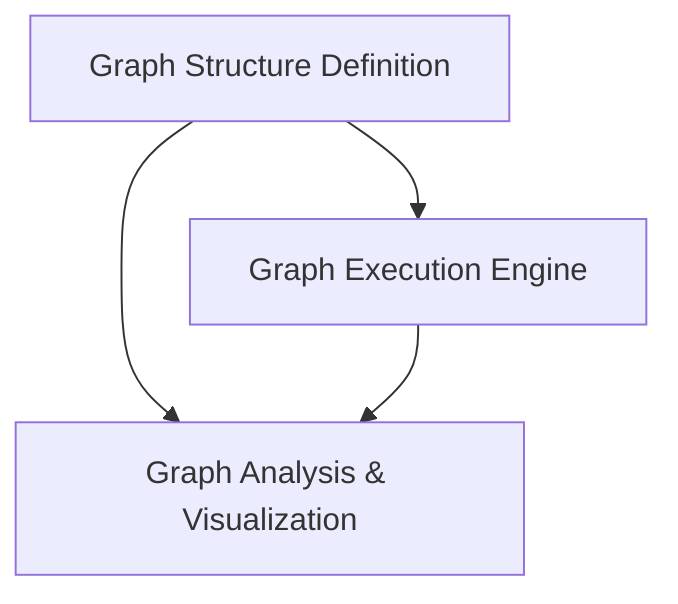

# Pydantic Graph Beta Module

The `pydantic_graph_beta` module introduces a powerful and flexible framework for defining, executing, and analyzing complex directed acyclic graphs (DAGs) in a Pydantic-native way. It provides enhanced capabilities for managing state, dependencies, and asynchronous execution flows, making it ideal for building sophisticated data pipelines, agentic workflows, and other graph-based applications.

## Architecture Overview

The module is structured into three primary sub-modules, each responsible for a distinct aspect of graph management:

1.  **Graph Definition**: Focuses on constructing the graph's nodes, steps, joins, and paths.
2.  **Graph Execution**: Handles the runtime execution, iteration, and state management of a graph.
3.  **Graph Analysis & Rendering**: Provides utilities for structural analysis and visual representation of the graph.

These sub-modules work together to provide a comprehensive system for building and interacting with Pydantic graphs. The graph definition drives the execution, and both definition and execution can be analyzed and visualized for better understanding and debugging.

<!-- DIAGRAM_JSON
{
    "direction": "TD",
    "nodes": [
        {"id": "graph_definition", "label": "Graph Structure Definition", "type": "module", "link": "graph_definition.md"},
        {"id": "graph_execution", "label": "Graph Execution Engine", "type": "module", "link": "graph_execution.md"},
        {"id": "graph_analysis_and_rendering", "label": "Graph Analysis & Visualization", "type": "module", "link": "graph_analysis_and_rendering.md"}
    ],
    "edges": [
        {"source": "graph_definition", "target": "graph_execution"},
        {"source": "graph_definition", "target": "graph_analysis_and_rendering"},
        {"source": "graph_execution", "target": "graph_analysis_and_rendering"}
    ],
    "groups": []
}
-->

## High-Level Functionality

### [Graph Structure Definition](graph_definition.md)
This sub-module is responsible for the declarative aspects of building a graph. It includes classes for defining the graph itself, individual execution steps, join points for parallel branches, and fluent APIs for constructing complex execution paths.

### [Graph Execution Engine](graph_execution.md)
This sub-module provides the core runtime for executing Pydantic graphs. It manages the asynchronous flow of data through the graph, handles task scheduling, orchestrates fork and join operations, and tracks the overall state and results of a graph run.

### [Graph Analysis & Visualization](graph_analysis_and_rendering.md)
This sub-module offers tools to understand and represent the structure of a Pydantic graph. It includes functionalities for identifying complex relationships like parent forks for join nodes, crucial for deadlock prevention, and for rendering the graph into human-readable formats like Mermaid diagrams.
