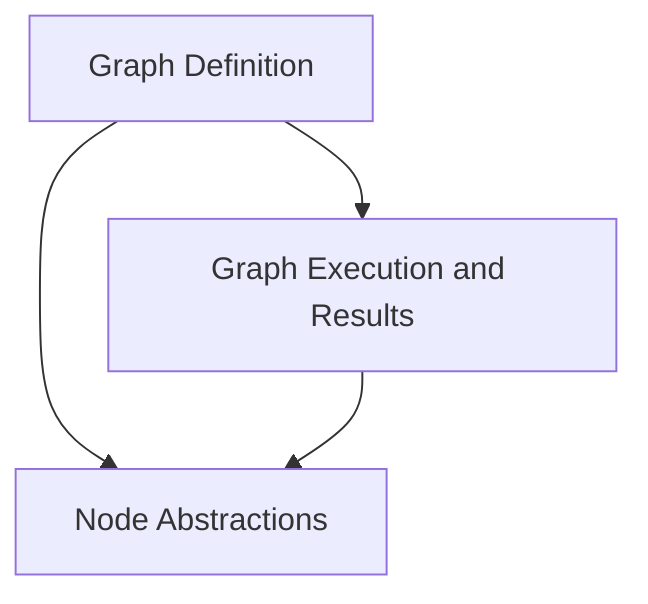

# pydantic_graph_core Module Documentation

## Introduction and Purpose

The `pydantic_graph_core` module provides the fundamental building blocks for defining, executing, and managing graph-based workflows. It leverages Pydantic for robust data modeling and type enforcement, enabling developers to create complex, stateful processes with clear definitions and predictable behavior. This module is central to orchestrating sequences of operations, where each step (node) can transform a shared state and dictate the flow to subsequent steps.

## Architecture Overview

The `pydantic_graph_core` module is structured around three main sub-modules, each responsible for a distinct aspect of graph management: graph definition, graph execution, and node abstractions. These components work together to provide a flexible and extensible framework for building dynamic workflows.

<!-- DIAGRAM_JSON
{
    "direction": "TD",
    "nodes": [
        {"id": "graph_definition", "label": "Graph Definition", "type": "module", "link": "graph_definition.md"},
        {"id": "graph_execution", "label": "Graph Execution and Results", "type": "module", "link": "graph_execution.md"},
        {"id": "node_abstractions", "label": "Node Abstractions", "type": "module", "link": "node_abstractions.md"}
    ],
    "edges": [
        {"source": "graph_definition", "target": "graph_execution"},
        {"source": "graph_definition", "target": "node_abstractions"},
        {"source": "graph_execution", "target": "node_abstractions"}
    ],
    "groups": []
}
-->

## High-Level Functionality

### [Graph Definition](graph_definition.md)
This sub-module focuses on the `Graph` class, which serves as the central entity for defining the structure and behavior of a workflow. It allows developers to specify a sequence of interconnected nodes and manage their relationships.

### [Graph Execution and Results](graph_execution.md)
This sub-module handles the runtime aspects of a graph. It includes the `GraphRun` class for executing a defined graph, managing its state, and providing mechanisms for iterating through nodes. The `GraphRunResult` captures the outcome of a completed graph run.

### [Node Abstractions](node_abstractions.md)
This sub-module provides the foundational `BaseNode` abstract class. All operational steps within a graph inherit from `BaseNode`, ensuring a consistent interface for defining execution logic, handling state, and determining the next node in the workflow.