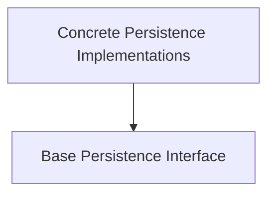

# Pydantic Graph Persistence Module

## Introduction

The `pydantic_graph_persistence` module is responsible for managing the state and history of graph runs within the pydantic-graph framework. It provides abstract interfaces and concrete implementations for persisting the graph's state, including node snapshots and run results. This enables features like resuming interrupted graph executions, debugging, and auditing.

## Architecture Overview

The module is structured around a base abstract class that defines the persistence contract, with various concrete implementations providing different storage mechanisms.

<!-- DIAGRAM_JSON
{
    "direction": "TD",
    "nodes": [
        {"id": "base_persistence_interface", "label": "Base Persistence Interface", "type": "module", "link": "base_persistence_interface.md"},
        {"id": "concrete_persistence_models", "label": "Concrete Persistence Implementations", "type": "module", "link": "concrete_persistence_models.md"}
    ],
    "edges": [
        {"source": "concrete_persistence_models", "target": "base_persistence_interface"}
    ],
    "groups": []
}
-->

## Sub-modules

### [Base Persistence Interface](base_persistence_interface.md)

This sub-module defines the `BaseStatePersistence` abstract class, which serves as the foundation for all persistence implementations. It outlines the core methods for snapshotting graph states at different stages (node execution, run end), recording node runs, and loading historical data. Implementations of this interface provide the actual storage logic.

### [Concrete Persistence Implementations](concrete_persistence_models.md)

This sub-module contains the concrete classes that implement the `BaseStatePersistence` interface. It currently includes `FileStatePersistence`, which stores graph run snapshots in a JSON file, and `FullStatePersistence`, which manages graph history entirely in memory. These implementations handle the serialization, deserialization, and storage of graph states and nodes.