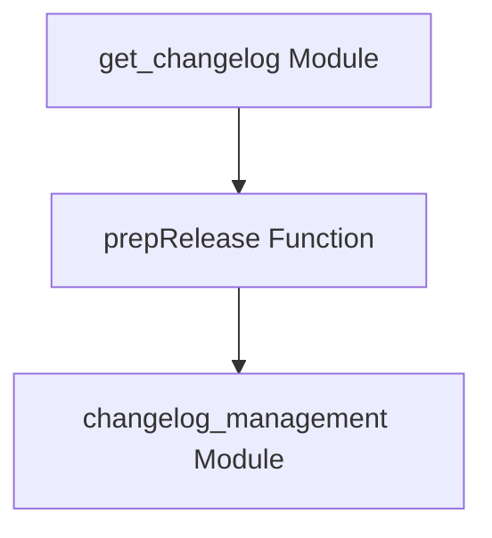

# release_preparation Module Documentation

## Introduction

The `release_preparation` module is a vital component within the `docs_site_utils` ecosystem, specifically designed to format and prepare release notes for display on the documentation site. Its primary function is to transform raw release information into a human-readable and well-linked markdown format, ensuring consistency and ease of navigation for users reviewing project updates.

## Core Functionality

The `release_preparation` module encapsulates the logic for the `prepRelease` function. This function takes a `Release` object, which typically contains details about a new software release, including its name, tag, URL, and a markdown body. The `prepRelease` function then processes this markdown body to:

1.  **Adjust Headings**: It modifies markdown headings (e.g., `#` to `##`) to fit the overall documentation site's styling.
2.  **Link Pull Requests**: Automatically converts GitHub pull request URLs (e.g., `https://github.com/pydantic/pydantic-ai/pull/123`) into compact markdown links (e.g., `[#123](https://github.com/pydantic/pydantic-ai/pull/123)`).
3.  **Link User Profiles**: Transforms GitHub usernames (e.g., `@username`) into clickable links to their GitHub profiles (e.g., `[@username](https://github.com/username)`).
4.  **Format Full Changelog Link**: Replaces a specific "Full Changelog" pattern with a more descriptive and icon-enhanced link to the comparison diff on GitHub.
5.  **Construct Final Output**: Combines the formatted release name, processed body, and a direct link to the release on GitHub into a complete markdown string ready for rendering.

## Architecture and Component Relationships

The `release_preparation` module is a sub-module of [changelog_management](changelog_management.md). It is a leaf module, meaning its core functionality is self-contained within the `prepRelease` function.

This module works in conjunction with the [get_changelog](get_changelog.md) module, which is responsible for retrieving or generating the raw changelog data that `release_preparation` then formats.

### Diagram

<!-- DIAGRAM_JSON
{
    "direction": "TD",
    "nodes": [
        {"id": "prep_release_function", "label": "prepRelease Function", "type": "component", "link": null},
        {"id": "get_changelog_module", "label": "get_changelog Module", "type": "external", "link": "get_changelog.md"},
        {"id": "changelog_management_module", "label": "changelog_management Module", "type": "external", "link": "changelog_management.md"}
    ],
    "edges": [
        {"source": "get_changelog_module", "target": "prep_release_function"},
        {"source": "prep_release_function", "target": "changelog_management_module"}
    ],
    "groups": []
}
-->

**Explanation of Diagram:**
*   **`prepRelease Function`**: Represents the core functionality provided by this `release_preparation` module.
*   **`get_changelog Module`**: An external module that likely provides the raw changelog data which `prepRelease` consumes and formats.
*   **`changelog_management Module`**: The parent module that conceptually contains and orchestrates the `prepRelease` function as part of its overall changelog management responsibilities.

## Integration with Overall System

The `release_preparation` module plays a crucial role in maintaining up-to-date and well-presented release notes on the documentation website. It ensures that every new release's information, typically retrieved or generated by modules like [get_changelog](get_changelog.md), is consistently formatted before being displayed. This standardization enhances the user experience by providing clear, navigable, and linked release summaries, contributing directly to the overall quality and maintainability of the `docs_site_utils` system.
