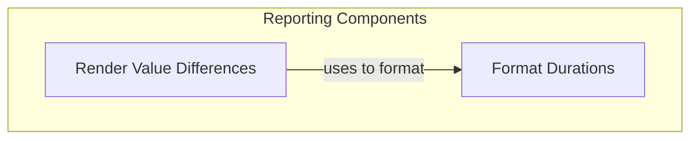

# Reporting and Rendering Module

## Introduction

The `reporting_and_rendering` module, part of the `pydantic_evals` framework, is responsible for formatting and presenting numerical and duration data in a clear and consistent manner for evaluation reports. It provides utilities to calculate and render differences between values, as well as format single duration measurements into human-readable strings. This module ensures that evaluation results are easy to interpret and compare.

## Architecture Overview

The module is structured into two main sub-modules: `difference_rendering` and `duration_formatting`. The `duration_formatting` sub-module provides the foundational capability to format raw time values, which is then utilized by the `difference_rendering` sub-module to present changes in durations. This clear separation of concerns allows for flexible and reusable formatting logic.

## Sub-modules

### [Difference Rendering](difference_rendering.md)
This sub-module focuses on calculating and formatting the differences between two numerical values or durations. It handles various scenarios, including integer differences, float differences with significant figures, percentage changes, and multiplier representations for clarity in reporting.

### [Duration Formatting](duration_formatting.md)
This sub-module is dedicated to converting raw duration values (in seconds) into user-friendly string formats. It automatically adjusts the units (microseconds, milliseconds, or seconds) based on the magnitude of the duration, ensuring optimal readability.

<!-- DIAGRAM_JSON
{
    "direction": "TD",
    "nodes": [
        {"id": "difference_rendering", "label": "Render Value Differences", "type": "module", "link": "difference_rendering.md"},
        {"id": "duration_formatting", "label": "Format Durations", "type": "module", "link": "duration_formatting.md"}
    ],
    "edges": [
        {"source": "difference_rendering", "target": "duration_formatting", "label": "uses to format"}
    ],
    "groups": [
        {
            "id": "rendering_logic",
            "label": "Rendering Logic",
            "role": "generative",
            "nodes": ["difference_rendering"]
        },
        {
            "id": "formatting_utilities",
            "label": "Formatting Utilities",
            "role": "generative",
            "nodes": ["duration_formatting"]
        }
    ]
}
-->
