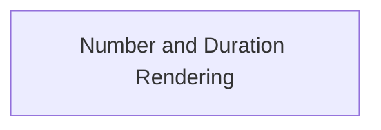

# Reporting Renderers Module Documentation

## Introduction

The `reporting_renderers` module is responsible for formatting and rendering numerical data, such as differences and durations, for various reporting purposes within the `pydantic_evals` system. It provides consistent and readable representations of quantitative information, making reports easier to interpret.

## Architecture Overview

The `reporting_renderers` module consists of a core sub-module dedicated to handling the rendering of numbers and durations. This sub-module encapsulates the logic for calculating and formatting these values, ensuring reusability and maintainability.

<!-- DIAGRAM_JSON
{
    "direction": "TD",
    "nodes": [
        {"id": "number_and_duration_rendering", "label": "Number and Duration Rendering", "type": "module", "link": "number_and_duration_rendering.md"}
    ],
    "edges": [],
    "groups": []
}
-->

## Sub-modules

### [Number and Duration Rendering](number_and_duration_rendering.md)

This sub-module contains the core logic for rendering numerical differences and durations. It provides functions to format absolute and relative differences between numbers, as well as human-readable representations of time durations. Its components ensure that all numerical outputs in reports are presented clearly and consistently.
