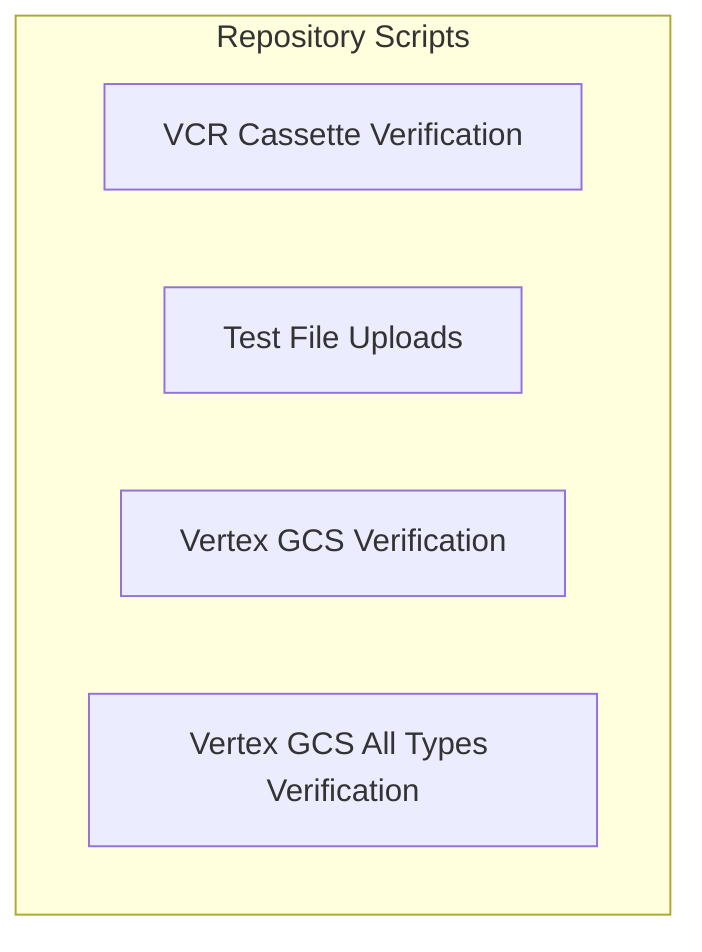

# Repository Scripts Module Documentation

## Introduction

The `repository_scripts` module consolidates various utility scripts essential for the development, testing, and maintenance of the larger system. These scripts automate tasks such as verifying VCR cassettes, uploading test data to cloud providers, and validating Vertex AI integrations with Google Cloud Storage.

## Architecture Overview

The `repository_scripts` module is a collection of standalone scripts, each designed to perform a specific function. While they operate independently, they collectively support the integrity and functionality of the repository. The architecture is modular, allowing for easy addition or modification of individual scripts without affecting others.

<!-- DIAGRAM_JSON
{
    "direction": "TD",
    "nodes": [
        {"id": "cassette_checks", "label": "VCR Cassette Verification", "type": "module", "link": "cassette_checks.md"},
        {"id": "file_uploads", "label": "Test File Uploads", "type": "module", "link": "file_uploads.md"},
        {"id": "vertex_gcs_verification", "label": "Vertex GCS Verification", "type": "module", "link": "vertex_gcs_verification.md"},
        {"id": "vertex_gcs_verification_all_types", "label": "Vertex GCS All Types Verification", "type": "module", "link": "vertex_gcs_verification_all_types.md"}
    ],
    "edges": [
        
    ],
    "groups": []
}
-->

## Sub-modules

Here are the core sub-modules within `repository_scripts`:

*   **[VCR Cassette Verification](cassette_checks.md)**: This script checks for orphaned VCR cassettes, ensuring all recorded network interactions have corresponding tests, helping to identify and remove dead code.

*   **[Test File Uploads](file_uploads.md)**: This module handles the automated upload of test files to various cloud providers (e.g., OpenAI, Google, Anthropic, XAI, Bedrock) to facilitate integration testing.

*   **[Vertex GCS Verification](vertex_gcs_verification.md)**: This script verifies that Vertex AI can correctly process specific file types stored in Google Cloud Storage (GCS) using provided URIs.

*   **[Vertex GCS All Types Verification](vertex_gcs_verification_all_types.md)**: This script extends the GCS verification to cover a comprehensive range of file types, ensuring robust integration between Vertex AI and Google Cloud Storage.