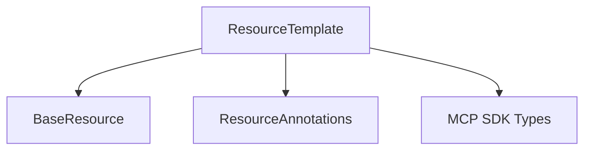

# resource_template_definition

**Module Path:** `pydantic_ai_slim.pydantic_ai.mcp`

This module defines the `ResourceTemplate` class, which is a fundamental component for working with parameterized resources within the Model Context Protocol (MCP) framework. It provides a structured way to define templates for resource URIs and associated metadata, enabling dynamic resource creation and management on MCP servers.

## Architecture and Component Relationships

<!-- DIAGRAM_JSON
{
    "direction": "TD",
    "nodes": [
        {"id": "resource_template", "label": "ResourceTemplate", "type": "component", "link": null},
        {"id": "base_resource", "label": "BaseResource", "type": "external", "link": "resource_definition.md"},
        {"id": "resource_annotations", "label": "ResourceAnnotations", "type": "external", "link": "mcp_resource_models.md"},
        {"id": "mcp_types_sdk", "label": "MCP SDK Types", "type": "external", "link": null}
    ],
    "edges": [
        {"source": "resource_template", "target": "base_resource"},
        {"source": "resource_template", "target": "resource_annotations"},
        {"source": "resource_template", "target": "mcp_types_sdk"}
    ],
    "groups": []
}
-->

### `ResourceTemplate`

The `ResourceTemplate` class extends `BaseResource` (defined in the [resource_definition module](resource_definition.md)) and encapsulates the definition of a template for parameterized resources. It adheres to the [MCP specification for resource templates](https://modelcontextprotocol.io/specification/2025-06-18/server/resources#resource-templates).

**Core Attributes:**

*   `uri_template` (str): An [RFC 6570](https://www.rfc-editor.org/rfc/rfc6570) URI template used to construct concrete resource URIs from parameters.
*   `name` (str, inherited): The name of the resource template.
*   `title` (str, inherited): A human-readable title for the resource template.
*   `description` (str, inherited): A brief description of the resource template.
*   `mime_type` (str, inherited): The MIME type of the resources generated from this template.
*   `annotations` (ResourceAnnotations, optional): Additional annotations for the resource, handled by the [mcp_resource_models module](mcp_resource_models.md).
*   `metadata` (dict, optional): Arbitrary metadata associated with the resource template.

**Key Methods:**

*   `from_mcp_sdk(mcp_template: mcp_types.ResourceTemplate) -> ResourceTemplate`:
    This class method facilitates the conversion of an MCP SDK `ResourceTemplate` object into a `PydanticAI ResourceTemplate` instance. It maps the attributes from the SDK representation to the internal `ResourceTemplate` structure, including handling of `ResourceAnnotations`.

## System Integration

The `resource_template_definition` module plays a crucial role within the `pydantic_ai_misc` module's [mcp_integration](mcp_integration.md) sub-system, specifically within [mcp_resource_models](mcp_resource_models.md). It provides the foundational structure for defining how dynamic resources are templated and managed on an MCP server. This allows other modules, such as `mcp_http_server` (within [mcp_integration](mcp_integration.md)), to understand and serve parameterized resources based on these templates. By providing a clear and standardized definition for resource templates, this module ensures consistency and interoperability across different components interacting with MCP servers.

It depends on the [resource_definition module](resource_definition.md) for its base `BaseResource` functionality and interacts with generic `MCP SDK Types` for deserialization. The `ResourceAnnotations` (likely defined or managed within the [mcp_resource_models module](mcp_resource_models.md)) further enrich the resource metadata. This structured approach is essential for robust and scalable MCP server implementations.